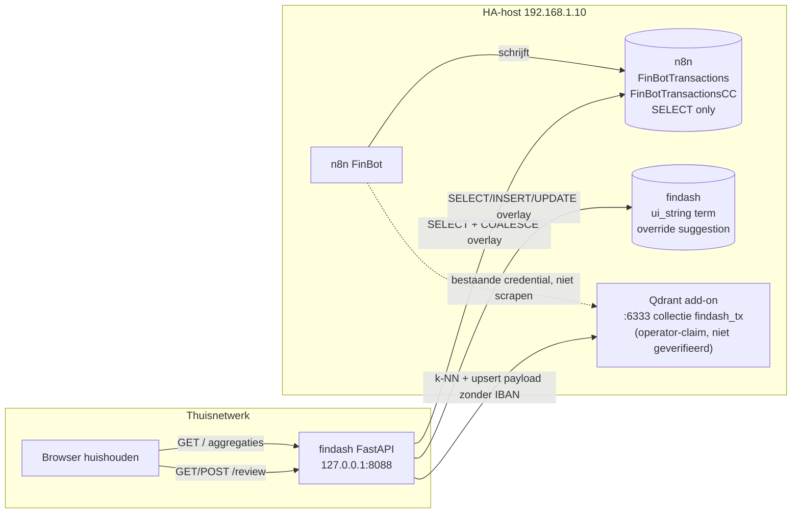
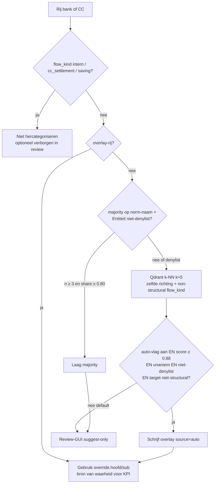

# findash — Qdrant-categorisatie en correctie-GUI

| Veld | Waarde |
|---|---|
| Auteur | findash-ontwerp |
| Datum | 2026-09-14 |
| Status | **Draft** — ter goedkeuring. Geen applicatiecode, migraties of `.env`-wijzigingen tot de gebruiker dit ontwerp goedkeurt. |
| Bron | [`docs/briefing.md`](briefing.md), [`docs/design-v1.md`](design-v1.md), [`docs/hygiene-bevindingen.md`](hygiene-bevindingen.md) (sectie Qdrant-route), [`AGENTS.md`](../AGENTS.md) |
| Taal | Nederlands (product); identifiers/SQL/code in het Engels |
| Revisie | 2026-09-15c — n8n-uitfasering + kopie naar schema `findash` + Similarity; zie `design-import.md`. |

---

## Overview

v1 van findash toont gecategoriseerde uitgaven en inkomsten uit `n8n.FinBotTransactions` (~6595) en `n8n.FinBotTransactionsCC` (~390) via een SQL-`CASE` (`flow_kind` in `app/classify.py`). Categorieën komen van FinBot/n8n. Hygiene-restjes (winkelrefunds als inkomen, `overig`-emmers, te brede entiteiten zoals `persoon` / kale `ING`) zitten nog in die bron. De dashboard-user is bedoeld `SELECT`-only op FinBot; het dashboard schrijft die tabellen niet.

Dit ontwerp voegt een **hybride categoriseerder** toe, geen vervanging van de harde regels: (1) bestaande `flow_kind`-regels eerst, (2) exacte/majority-hit op genormaliseerde naam + `Entiteit`, (3) Qdrant k-NN op IBAN-vrije omschrijving plus prefix `Af|A|…`, (4) suggesties in een correctie-GUI, (5) correcties naar een **findash-overlay** én naar Qdrant-payload. Auto-apply alleen achter een hoge drempel, unanieme buren, en niet voor denylist-entiteiten — default is **suggest-only**. Qdrant draait al op het LAN als Home Assistant-add-on (`http://192.168.1.10:6333`, zelfde host als MariaDB). findash krijgt een **eigen collectie** `findash_tx` (384-d, cosine, lokaal multilingual-e5-small via FastEmbed). De operator roteert de API-key in de add-on en zet hem in gitignored `.env`; deze schrijfpass verbindt niet met Qdrant.

---

## Background & Motivation

### Huidige staat

- Dashboard v1 live op `127.0.0.1:8088` (FastAPI + Jinja2 + HTMX + Chart.js + pymysql). Geen login, niet op internet.
- Classificatie: `BANK_FLOW_SQL` / `CC_FLOW_SQL` in [`app/classify.py`](../app/classify.py) — `internal`, `cc_settlement`, `saving`, `income`, `refund`, `expense`.
- Aggregaties: [`app/queries.py`](../app/queries.py) leest FinBot-hoofd/sub. Overlay bestaat nog niet.
- Inspect: `GET /tx` toont tot 200 rijen met `redact_text()` op `Naam / Omschrijving` / `Omschrijving` ([`app/formatters.py`](../app/formatters.py)). Geen `Mededelingen`, geen ruwe `Tegenrekening` in de UI (interne stromen mappen tegenrekening via `known_counterpart` naar bekende labels).
- Vertalingen en chrome in database `findash` (`ui_string`, `term`). Runtime-user heeft live `SELECT` op `n8n` en momenteel ALL op `findash` (gebruikt om 001–003 te seeden).
- Qdrant: HA-add-on op dezelfde host als MariaDB. De operator heeft de API-key niet los bewaard; n8n toont bullets. **Niet terughalen.** Roteren in de add-on, daarna n8n-credential én findash-`.env` bijwerken.
- ~7k gelabelde rijen is volgens de hygiene-beoordeling genoeg voor k-NN. FinBot/Grok-`Confidence` is **geen** Qdrant-score.

### Pijnpunten

1. Foute of ruis-categorieën in FinBot blijven in de KPI’s tot iemand phpMyAdmin opent. De dashboard-user mag FinBot niet schrijven.
2. `Entiteit` is onbruikbaar als enige sleutel: `persoon` (281 rijen, 20 hoofd/sub-combinaties), kale `ING` (meerdere cats), `spaarrekening` zonder richting.
3. Exacte merchant-match vangt AH/Lidl-typos en CC-omschrijvingen niet; k-NN op genormaliseerde tekst wel.
4. Een tweede dienst of live embedding-API vanaf het LAN is onnodig zwaar en een datalek-risico.
5. Bestaande FinBot-vectoren in Qdrant zijn **niet inspecteerbaar** zonder key; payloads kunnen PII bevatten. Default is daarom een schone eigen collectie.

---

## Goals & Non-Goals

### Goals

- Hybride pijplijn: harde regels → overlay → majority → Qdrant k-NN, in die volgorde.
- Correctie-GUI in dezelfde FastAPI-app (nieuwe route + HTMX), loopback, drie talen via bestaande i18n.
- Correctie schrijft `{FINDASH_DATABASE}.category_override` en upsert de Qdrant-payload. **Geen** writes naar `n8n`/FinBot in deze feature.
- Overlay telt mee in dashboard-KPI’s en grafieken voor **getoonde** hoofd/sub en voor de staart `income`/`refund`/`expense`. Structurele `flow_kind` (`internal` / `cc_settlement` / `saving`) blijft op **FinBot-kolommen** (zie Key Decision 1/8). Geen MariaDB-alias-`CASE` op dezelfde SELECT-lijst.
- Indextekst en UI-tekst: IBAN-achtige tokens strippen vóór embed én vóór render. Geen Raw, geen `Tegenrekening`, geen `Mededelingen`/`Mutatie` in selecties voor deze feature.
- Feature uit als `QDRANT_URL` of `QDRANT_API_KEY` ontbreekt: overlay + handmatige GUI blijven werken; k-NN-suggesties niet.
- Operatorstap 0: key roteren, `.env` vullen, `scripts/test_qdrant.py` (collectienamen only, key nooit printen).
- Unit tests met fake Qdrant-client; geen live Qdrant in CI.

### Non-Goals

- Geen write-back naar FinBot (`UPDATE n8n.FinBotTransactions…`). Dat is een later, expliciet operator-PR.
- Geen vervanging van `flow_kind`-harde regels door k-NN.
- Geen centroid/majority-sleutel op denylist-entiteiten (`persoon`, kale `ING`, `spaarrekening` zonder richting).
- Geen externe embedding-API (OpenAI, Voyage, …) vanaf het huishoud-LAN.
- Geen hergebruik van een eventuele FinBot-collectie als default (payload onbekend, mogelijk PII, dimensie onbekend).
- Geen HA-add-on-pakket van findash (blijft v2).
- Geen dashboard-login, geen publieke bind, geen tweede HTTP-service.
- Geen query op `FinBotTransactionsRaw`.
- Geen Qdrant-connectie of poortscan in deze ontwerp-pass.
- Geen `QDRANT_*` in `scripts/db_env.py` `REQUIRED` (MariaDB-probes moeten blijven werken).
- Deze feature **wijzigt** design-v1 Key Decision 2: de runtime-user blijft `SELECT`-only op `n8n`, maar krijgt DML op `findash` (overlay). v1 zei SELECT-only op beide.
- `/review` **wijzigt** de v1-non-goal “geen transactieregel-browser met `Naam / Omschrijving`”: dezelfde redacted omschrijving als live `GET /tx`, nog steeds zonder `Mededelingen` / ruwe `Tegenrekening` / `Mutatie` / Raw.

---

## Proposed Design

### Logische architectuur



Qdrant zit **niet** in het pad van `GET /` (overzicht). KPI’s lezen MariaDB + overlay. Qdrant wordt geraakt bij ingest, suggestion-refresh, neighbor-expand op `/review`, en bij een correctie-upsert.

### Pijplijn (ordeninggevoelig)



**Laag 1 — harde regels (FinBot-kolommen).** Structurele `flow_kind` (`internal`, `cc_settlement`, `saving`) evalueert **altijd** de originele FinBot-velden: bank `t.Hoofdcategorie` / `t.Subcategorie` / `Rekening` / `` `Af Bij` ``; CC `Type` + `` `Af Bij` `` + FinBot-hoofd. Overlay, majority en k-NN mogen die classificatie niet omzetten. Review-filter `structural` kan de rijen tonen, default uit. `POST /review/correct` **weiger** ze (400) tenzij `confirm_structural=1` — en zelfs dan blijft `flow_kind` structureel. Overlay is dan alleen MariaDB-display in `/review`; **geen** Qdrant-upsert (zelfde skip als ingest: structurele FinBot-`flow_kind` krijgt nooit een punt in `findash_tx`). Echt intern→expense blijft phpMyAdmin op FinBot (buiten scope).

**Laag 2 — overlay (niet-structurele staart).** `{FINDASH_DATABASE}.category_override` keyed op `(src, transactie_id)` met `src ∈ {bank, cc}`. Voor getoonde `hoofd`/`sub` en voor `income` / `refund` / `expense` wint overlay van FinBot (`COALESCE` in een **inner derived table**, daarna `CASE` op de buitenkant — MariaDB mag geen SELECT-alias in dezelfde select-lijst gebruiken). AH-statiegeld: FinBot `Inkomsten/overig` + `Bij` + overlay `Huishouden/boodschappen` → `refund`. Intern + overlay boodschappen blijft `internal` en buiten uitgaven-KPI’s.

**Laag 3 — majority.** Refresh-job (geen extra MariaDB-tabel). Sleutel = `normalize(omschrijving)` + `Entiteit`. Treffer als `n ≥ 3` en aandeel van de modus `(hoofd, sub) ≥ 0.80`. Overslaan als `Entiteit` op de centroid-denylist staat. Majority-hit schrijft `layer='majority'` en **gaat niet** door k-NN (geen `REPLACE` daarna met `layer='knn'`). Verplichte kolommen: `score = share` (0.80–1.00, niet cosine), `unanimous = 1` (zodat FinBot-disakkoord in queue `mismatch` valt), `neighbor_n = n` (groepsgrootte; kolom `SMALLINT UNSIGNED`, AH ≫ 255).

**Laag 4 — k-NN.** Alleen rijen zonder majority-hit (of denylist-entiteit). Queryvector = embed(`query: ` + indextekst). Filter: payload `richting` gelijk aan de query **én** `flow_kind` ∈ `{expense, refund, income, unclassified}`. Structurele punten worden **niet** geïndexeerd (geen intern-buren op een AH-query). `rekening` niet filteren. `Confidence` uit FinBot speelt geen rol in de score.

**Auto vs suggest (Key Decision).** Default `FINDASH_QDRANT_AUTO=0`: nooit auto-schrijven. GUI toont de suggestie. Auto alleen als de vlag `1` is **en** `score ≥ 0.88` **en** minstens 3 buren **en** alle buren dezelfde `(hoofd, sub)` **en** query-`Entiteit` niet denylist **en** het target-paar geen structurele WHENs zou triggeren (`Interne overboeking`, `Overige uitgaven`+`creditcard`, sub `sparen`/`van spaarrekening`). Drempels zijn startwaarden; `scripts/refresh_suggestions.py --calibrate` print een histogram (overeenkomst met FinBot, zonder PII) zodat de operator ze later kan bijstellen. Calibrate mag k-NN wél op majority-rijen draaien, maar alleen naar stderr-counts, niet naar `category_suggestion`.

### Eigen Qdrant-collectie

| Parameter | Waarde |
|---|---|
| Naam | `findash_tx` |
| Vector size | 384 |
| Distance | Cosine |
| HNSW | default (`m=16`, `ef_construct=100`); 7k punten, geen quantization |
| Point id | `uuid.uuid5(uuid.NAMESPACE_URL, "findash:{src}:{TransactieID}")` — stabiel over heringest |
| `src` | `bank` of `cc` (voorkomt botsing als beide tabellen ooit dezelfde `TransactieID` hebben) |

**Payload** (geen IBAN, geen Raw, geen `Mededelingen`, geen `Tegenrekening`, geen secrets):

```python
{
    "src": "bank",              # of "cc"
    "transactie_id": "<char40>",
    "hoofd": "Huishouden",
    "sub": "boodschappen",
    "entiteit": "Albert Heijn",  # mag leeg; denylist mag in payload, niet als centroid
    "richting": "Af",            # Af | Bij
    "rekening": "Rekening B",
    "jaar": 2026,
    "maand": 3,
    "flow_kind": "expense",      # FinBot-CASE, nooit overlay-structural-bypass
    "corrected": False,          # True na GUI/auto-override
}
```

Payload-indexen (keyword): `src`, `richting`, `hoofd`, `rekening`, `flow_kind`. Nodig voor gefilterde search, niet voor PII-zoeken. `flow_kind` in de payload is de FinBot-waarde (laag 1), zodat search structurele punten kan uitsluiten ook als `hoofd`/`sub` later overlay zijn.

### Embedding (lokaal)

| Keuze | Waarde | Rationale |
|---|---|---|
| Runtime | FastEmbed + ONNX (`fastembed`), geen PyTorch | klein genoeg voor de Mac; geen cloud-inferentie |
| Model | `intfloat/multilingual-e5-small` | 384-d, retrieval, NL-capable, ~120 MB ONNX |
| Prefix | document `passage: {index_text}`; query `query: {index_text}` | e5-contract; vergeten prefix is een test |
| Cache | `FINDASH_EMBED_CACHE` default `.cache/fastembed` (gitignored) | per host; niet verplicht naar `~/.cache` |
| ONNX | CPU `onnxruntime` (osx-arm64 op de Mac, manylinux later HA) | **niet** `onnxruntime-gpu` |
| Client | `qdrant-client` (HTTP naar `:6333`) | zelfde stack als n8n-ecosysteem, geen gRPC-plicht |

Indextekst (functie `index_text` in te bouwen `app/embed.py`):

```text
{Af|Bij}|{A|B}|{IBAN-vrije omschrijving}
```

Voorbeeld na strip: `Af|A|AH TO GO AMSTERDAM`. `Entiteit` zit **niet** in de vectortekst (anders wegen `persoon`/`ING` te zwaar); wel in payload. `Rekening B` → prefix `B`, idem A; onbekend → `Onbekend`.

IBAN-strip hergebruikt en **versterkt** `_IBAN_RE` uit `app/formatters.py`:

- bestaande `\b[A-Z]{2}\d{2}[A-Z0-9]{10,30}\b` → `…`
- runs van ≥ 8 cijfers → `…` (rekeningachtig, geen IBAN-vorm)
- collapse whitespace, trim, cap 200 tekens voor embed (UI blijft `redact_text(..., limit=80)`)

Zelfde strip op alles wat naar Qdrant of naar de review-HTML gaat. Tests gebruiken synthetische `NL00XXXX0123456789` zoals `tests/test_tx.py`, geen echte IBAN’s.

**Embedder-runtime (zelfde proces, geen tweede HTTP-dienst):**

| Vraag | Keuze |
|---|---|
| Waar draait het model | In het findash-proces (mode A: Mac-uvicorn; later HA-image: daar). **Niet** in de Qdrant-add-on. Geen embed-microservice. |
| Module-splits | `app/embed.py`: pure `index_text` / `strip_iban` / `normalize` **zonder** `import fastembed`. Class `Embedder` importeert FastEmbed **lui** in `__init__`. `app/qdrant_io.py` idem: geen module-level `import qdrant_client`. v1 `uvicorn` zonder extras blijft `/` en `/review` (handmatig) serveren. |
| Load-policy | Ingest/refresh: eager bij script-start. Uvicorn: lazy **eenmaal** achter een `threading.Lock` bij eerste `GET /review/neighbors`. Eerste neighbor na koud proces mag de 500 ms-p95 missen; daarna cache. Documenteer: draai ingest eerst zodat `.cache/fastembed` gevuld is. |
| HF-download | Alleen ingest of eerste Embedder-init als de cache leeg is. **Niet** in pytest (fake embedder). **Niet** impliciet bij `GET /`. |
| Pins | `requirements-qdrant.txt`: `qdrant-client`, `fastembed`, CPU-`onnxruntime`. Operator: `pip install -r requirements-qdrant.txt` vóór probe (PR 1, alleen client) en vóór ingest/neighbors (PR 5+). |
| Docker | `Dockerfile` blijft `requirements.txt` (v1). Compose mode B serveert `/review/neighbors` pas na image-extras of een tweede stage; tot die tijd 503-fragment “Qdrant/embedder uit”. HA-verhuizing: `.cache/fastembed` meekopiëren of één HF-fetch vanaf een host die HuggingFace haalt. |

### Schaal en latency (huishouden)

| Werk | Ordegrootte | Target |
|---|---|---|
| Punten | ~7k × 384 × 4 B ≈ 11 MB + payload | past in RAM van de add-on |
| Embed 7k (CPU, e5-small ONNX) | ~100 zinnen/s → 35–70 s | ingest p95 &lt; 120 s inclusief upsert |
| k-NN k=5, 7k HNSW | sub–5 ms | search p95 &lt; 50 ms |
| Upsert 1 punt | &lt; 20 ms | p95 &lt; 50 ms |
| `GET /` overzicht | ongewijzigd: geen Qdrant | overlay-JOIN op 7k &lt; 20 ms extra |
| `GET /review` 20 rijen | SQL-queue + optioneel 1 live k-NN bij expand | p95 &lt; 500 ms |
| Suggestion-refresh heel corpus | embed skip (vector bestaat) + 7k search | &lt; 60 s |

Geen Prometheus. Timing via bestaande `TimedCursor` + extra `qdrant_ms` in review-footer.

### Majority-laag (Python in de refresh-job)

Geen extra MariaDB-tabel. De job groepeert ~7k rijen in process (zelfde schaal als de CC-matcher in `app/classify.py`). GUI en auto lezen `category_suggestion`. Dashboard leest overlay, niet suggestions.

`normalize(omschrijving)` is exact deze keten (unit-testbaar, geen SQL):

1. `strip_iban` (IBAN-regex + runs van ≥ 8 cijfers → `…`)
2. `casefold()`
3. verwijder tekens in `.,;:/-`
4. collapse whitespace (`" ".join(split())`)
5. cap 200 tekens

Sleutel = `(normalize(omschrijving), casefold(strip(Entiteit or "")))`. Treffer: `n ≥ 3` en aandeel modus `(hoofd, sub) ≥ 0.80`. Denylist-entiteit → geen majority, wel k-NN.

Denylist (centroid, casefold/strip):

```python
ENTITY_CENTROID_DENY_EXACT = frozenset({
    "persoon",
    "spaarrekening",
})
# kale ING: ^ing(\s+bank(\s+n\.?v\.?)?)?$  na casefold, punten weg
```

`Oranje Spaarrekening` is specifiek genoeg en staat **niet** op de denylist. Rijen met denylist-entiteit blijven wél in de vectorindex (de omschrijving is het signaal); ze tellen niet als majority-sleutel en zijn niet auto-eligible.

### Materialized suggestions

`GET /review` moet queues kunnen vullen (`mismatch`, `overig`, …) zonder 7k embeds per pageload.

```sql
-- schets; echte DDL in Data Model
category_suggestion (
  src, transactie_id,          -- PK
  hoofd, sub,
  score,                       -- majority: share 0.80–1.00; knn: cosine 0–1
  unanimous,                   -- majority: altijd 1; knn: 1 iff alle k buren dezelfde (hoofd,sub)
  neighbor_n,                  -- SMALLINT: majority = groepsgrootte n; knn = 1..5
  layer,                       -- majority | knn
  disagrees_with_finbot,
  computed_at
)
```

Job `scripts/refresh_suggestions.py`:

1. SELECT bank+CC, parameterized, geen Raw/`Mededelingen`/`Tegenrekening`/`Mutatie`. Wél genoeg kolommen om `BANK_FLOW_SQL` / `CC_FLOW_SQL` te evalueren: `TransactieID`, `Hoofdcategorie`, `Subcategorie`, `` `Af Bij` ``, `Rekening`, omschrijving, `Entiteit`, bank-bedrag, **CC `Type`**, `Jaar`, `Maand`.
2. Skip rijen waarvan FinBot-`flow_kind` ∈ `{internal, cc_settlement, saving}` (CC-incasso vereist `Type='Incasso'`).
3. Bouw majority-index in memory. Per niet-geskipte rij: als majority-hit → één `REPLACE` met `layer='majority'`, `score=share`, `unanimous=1`, `neighbor_n=n` (echte groepsgrootte), `disagrees_with_finbot` t.o.v. FinBot `(hoofd,sub)` — **stop** (geen k-NN, geen tweede write).
4. Resterende rijen (miss of denylist): batch-embed + k-NN; `REPLACE` met `layer='knn'`, `score=cosine`, `unanimous` zoals laag 4, `neighbor_n` = aantal teruggegeven buren (≤ 5).
5. `--calibrate`: mag k-NN ook op majority-rijen draaien; output alleen score-buckets vs FinBot-akkoord (counts, geen omschrijvingen) — **niet** naar `category_suggestion`.

Live Qdrant op row-expand (`GET /review/neighbors`) voor de vijf buren: `hoofd`, `sub`, `entiteit`, `richting`, `flow_kind`, `score` — geen `transactie_id` in de HTML; geen IBAN. Zelfde search-filter als laag 4 (non-structural).

### Correctie-GUI

Nieuwe pagina, geen tweede service. Chrome in [`app/templates/base.html`](../app/templates/base.html) krijgt een link **Review** naast het merk.

| Item | Keuze |
|---|---|
| Route | `GET /review` volledige pagina; HTMX voor rijen |
| Embed | niet hergebruiken als enige UI: `GET /tx` blijft read-only inspect van **FinBot-labels** (200 rijen, geen writes, geen overlay-JOIN) |
| Privacy vs v1 | `/review` toont dezelfde redacted omschrijving als live `/tx`; dat **wijzigt** de v1-non-goal “geen transactieregel-browser”, nog steeds zonder `Mededelingen` / ruwe `Tegenrekening` / `Mutatie` / Raw |
| Defaultperiode | dezelfde 12-maands bank-window als `GET /` (`default_from_to(MAX(Jaar*100+Maand))` op de banktabel) |
| Queue default | PR 4: `overig`. PR 8 (suggestions bestaan): `mismatch` |
| Grain | 20 rijen per pagina, keyset `(Jaar, Maand, src, transactie_id)` — bank-`id` en CC-`id` zijn aparte reeksen |
| Kolommen | datum, rekening, Af/Bij, bedrag, redacted omschrijving (80), FinBot hoofd/sub, suggestie, actie |
| Niet tonen | IBAN, `Tegenrekening`, `Mededelingen`, `Mutatie`, Raw, API-keys, `TransactieID` in copy-paste-blokken (alleen hidden form field) |
| Form | cascading: `hoofd` eerst, `sub` alleen paren die in FinBot `SELECT DISTINCT Hoofdcategorie, Subcategorie` UNION bestaan. Optioneel `Entiteit` (IBAN-strip); `note` optioneel |
| POST | altijd **200 + rij-partial** (geen 204: HTMX kan dan niet OOB-swappen). 400 bij onbekend paar, structureel zonder confirm, of IBAN-only note/entiteit |
| Undo | POST delete overlay; als er een Qdrant-punt was: payload terug naar FinBot-labels (`corrected=false`). Structurele confirm: overlay-DELETE, Qdrant no-op. Geen overlay-historie: undo = FinBot, niet “vorige overlay” |

Queues (query param `queue=`):

| Id | Selectie |
|---|---|
| `mismatch` | suggestion unaniem én `(hoofd,sub)` ≠ FinBot, geen overlay |
| `overig` | FinBot-`Subcategorie` casefold exact `overig`, geen overlay |
| `denylist` | `Entiteit` denylist, geen overlay |
| `unclassified` | `flow_kind='unclassified'` |
| `suggest` | suggestion aanwezig, niet auto-eligible, geen overlay |
| `corrected` | overlay bestaat (naslag + undo) |

Default queues sluiten structurele rijen uit. `POST /review/correct` **weiger** (400, geen overlay-rij) als FinBot-`flow_kind` ∈ `{internal, cc_settlement, saving}` **of** als het target-paar structurele WHENs zou triggeren (`Hoofdcategorie = Interne overboeking`; `Overige uitgaven`+`creditcard`; sub ∈ `{sparen, van spaarrekening}`), tenzij hidden/opt-in `confirm_structural=1` (niet op het default-formulier). `confirm_structural` schrijft **alleen** de overlay-rij (display in `/review`); SQL-`flow_kind` blijft structureel op FinBot; **geen** Qdrant-upsert (ingest-skip: structurele punten bestaan niet in `findash_tx`, POST mag ze niet alsnog aanmaken). Undo van zo’n rij = overlay-DELETE, Qdrant no-op. Auto-apply (PR 9) heeft geen confirm-pad en weigert dezelfde targets.

`note` VARCHAR(512) kan huishoudnamen bevatten; `strip_iban` dekt dat niet. Acceptabel op loopback; niet loggen.

i18n: nieuwe `ui_string`-keys (`review.title`, `review.queue.*`, `review.save`, `review.undo`, `review.neighbors`, `review.qdrant_down`, …) in migratie-seed + `app/i18n.py` fallbacks, zelfde patroon als v1.

### Writes: wat waar

```mermaid
sequenceDiagram
  participant B as Browser
  participant A as FastAPI
  participant F as findash.category_override
  participant Q as Qdrant findash_tx
  participant N as n8n FinBot
  B->>A: POST /review/correct src + transactie_id + hoofd + sub
  A->>A: strip IBAN; pair-allowlist; weiger structural tenzij confirm
  A->>F: INSERT ... ON DUPLICATE KEY UPDATE
  alt FinBot flow_kind niet structural
    A->>Q: upsert payload hoofd/sub/entiteit corrected=true
  else structural confirm
    Note over Q: geen punt (zelfde skip als ingest)
  end
  Note over N: geen UPDATE
  A->>B: 200 + HTMX rij-partial (geen 204)
```

- **findash overlay:** bron van getoonde hoofd/sub en van de staart `income`/`refund`/`expense`. Structurele `flow_kind` blijft FinBot.
- **Qdrant payload:** zodat latere k-NN de correctie als buur ziet. Vector ongewijzigd (omschrijving wijzigt niet). `flow_kind` in payload blijft de FinBot-waarde. Overslaan als FinBot-`flow_kind` structureel is (confirm of niet).
- **n8n:** onaangeroerd.

Degradatie: Qdrant down → overlay-POST slaagt nog; upsert faalt → log warning, GUI toont “opgeslagen in findash, Qdrant later”. Ingest/refresh schrijft overlay-cats terug in de payload (`LEFT JOIN category_override`). Nooit de overlay rollbacken omdat Qdrant faalde.

**Re-ingest is veilig voor correcties.** `scripts/ingest_qdrant.py`:

1. `LEFT JOIN category_override` op `(src, TransactieID)`; payload `hoofd`/`sub`/`entiteit` = overlay indien aanwezig, anders FinBot; `corrected=true` bij overlay.
2. Collectie `findash_tx` **alleen aanmaken als die ontbreekt**. Bestaat ze met verkeerde vector size/distance: **fail** (niet droppen, niet recreaten, andere collecties niet aanraken).
3. Skip FinBot-`flow_kind` intern/cc_settlement/saving (niet indexeren).
4. UUID5-upsert is daardoor idempotent én overlay-preserving.

### Config en credentials

Patroon: [`app/config.py`](../app/config.py) `load_settings()` uitbreiden. [`scripts/db_env.py`](../scripts/db_env.py) `REQUIRED` blijft alleen `MARIADB_*`.

`.env.example` (wachtwoord/key leeg). `QDRANT_URL` host:port is een **operator-claim** (zelfde HA-host als MariaDB in het example); `docs/briefing.md` noemt poort 6333 **niet**. Deze ontwerp-pass verifieert de add-on niet.

```
QDRANT_URL=http://192.168.1.10:6333
QDRANT_API_KEY=
FINDASH_QDRANT_AUTO=0
FINDASH_EMBED_MODEL=intfloat/multilingual-e5-small
FINDASH_EMBED_CACHE=.cache/fastembed
FINDASH_QDRANT_COLLECTION=findash_tx
```

Feature k-NN aan ⇔ `QDRANT_URL` én `QDRANT_API_KEY` non-empty. Auto-apply extra ⇔ `FINDASH_QDRANT_AUTO=1`. Overlay-GUI heeft geen Qdrant nodig.

Transport is **HTTP op het LAN** (geen TLS). De API-key gaat in cleartext naar `:6333`. Past in het v1-dreigingsmodel (geen internet-expositie, 3306/6333 niet publiceren); wél noemen zodat een latere HA-TLS-stap optioneel blijft.

**Key-rotatie (operator, geen agent):**

1. HA Qdrant-add-on: nieuwe API-key genereren / plakken in add-on-config. Oude key ongeldig.
2. Zelfde nieuwe key in n8n-credential (GUI; bullets blijven bullets).
3. Zelfde nieuwe key in findash `.env` (`QDRANT_API_KEY=`). Mode 600, gitignored.
4. `PYTHONPATH=. .venv/bin/python scripts/test_qdrant.py` — zie volgende sectie.
5. Nooit de key in chat, git, uvicorn-accesslog, of HTML.

Niet: key uit n8n JSON of GUI terughalen.

### Operator-probe (later uitvoeren, niet in deze schrijfpass)

Nieuw [`scripts/test_qdrant.py`](../scripts/test_qdrant.py), stijl [`scripts/test_db_access.py`](../scripts/test_db_access.py):

- Eerst `pip install -r requirements-qdrant.txt` (PR 1: `qdrant-client` only; FastEmbed komt in PR 5).
- Leest `.env` zelf (niet via `db_env.REQUIRED`).
- Print `QDRANT_URL` host:port, **nooit** de key (ook niet gemaskeerd tot laatste 4 — te veel info in logs; print alleen `api_key: set|missing`).
- Timeout 5 s, HTTP `/collections` of `QdrantClient.get_collections()`. Key gaat HTTP-cleartext over het LAN (zie credentials).
- Output: collectie**namen** + punt-counts als de API dat zonder payload-scroll geeft. Geen `scroll` met payloads, geen point-dump.
- Exit 0 bij connect; 2 bij missing config; 1 bij connect-fout (generiek, geen key in exception-string — strip `api-key` headers).
- Als namen wijzen op een FinBot-collectie: print “existing collection(s) detected; findash remains on findash_tx unless operator decides otherwise.” Geen automatische reuse.

Deze ontwerp-pass voert de probe **niet** uit. De agent bevestigt de add-on niet.

### App-structuur (ná goedkeuring)

Uitbreiding op v1, geen nieuw package-root:

```
app/
  embed.py              # pure index_text/strip_iban/normalize; Embedder lazy
  qdrant_io.py          # optional import qdrant_client; upsert/search; disabled-stub
  hybrid.py             # majority + auto-eligibility (pure Python, geen Qdrant)
  main.py               # + GET /review, POST /review/correct, GET /review/neighbors
  db.py                 # FINDASH_TABLES += override, suggestion; overlay_exists()
  queries.py            # derived-table COALESCE + split CASE; outer cat-filters
  config.py             # optionele QDRANT_* / FINDASH_EMBED_* / AUTO
  templates/review.html
  templates/partials/review_rows.html
  templates/partials/review_neighbors.html
scripts/
  test_qdrant.py
  ingest_qdrant.py      # create collection + embed+upsert ~7k
  refresh_suggestions.py
sql/migrations/
  004_category_overlay.sql
tests/
  test_hybrid.py        # fake client
  test_embed_redact.py
  test_review_routes.py
```

**Keuze:** apart `requirements-qdrant.txt` (`qdrant-client` in PR 1; `fastembed` + CPU-`onnxruntime` in PR 5). Default `requirements.txt` / `pytest` op classify/health importeren die modules niet. `app.embed` en `app.qdrant_io` moeten importbaar zijn zonder extras (`Embedder`/`QdrantClient` pas bij aanroep).

Fake Qdrant-client: in-memory lijst punten, cosine met **stdlib** (`math` + `zip`); geen `numpy`, geen netwerk.

### Overlay in aggregaties

MariaDB laat een SELECT-lijst-alias **niet** door een andere expressie in dezelfde lijst gebruiken (`GROUP BY`/`ORDER BY`/`HAVING` wel). Live `BANK_FLOW_SQL` in [`app/classify.py`](../app/classify.py) noemt ongekwalificeerd `Hoofdcategorie` / `Subcategorie`. Die namen op dezelfde SELECT als `COALESCE(…) AS Hoofdcategorie` binden aan **FinBot** `t.Hoofdcategorie`. Daarom: **inner derived table** voor COALESCE, daarna een **nieuwe** `BANK_FLOW_SQL_OVERLAY` / `CC_FLOW_SQL_OVERLAY` op de buitenkant. Niet de bestaande `BANK_FLOW_SQL`-string interpoleren naast COALESCE-aliassen.

**Invariant (tests in PR 3):**

1. Structurele WHENs op FinBot-originals (`finbot_hoofd`, `finbot_sub`, CC `Type`, `Rekening`, `` `Af Bij` ``).
2. Staart `income` / `refund` / `expense` op coalesced `hoofd` / `sub`.
3. `hoofd`/`sub`-filters van de request staan op de **buitenste** query op coalesced kolommen, niet op de inner FinBot-`FROM`.
4. SQL-stringtest: de gecomposeerde UNION bevat geen bare `Hoofdcategorie` in dezelfde select-lijst als `COALESCE(o.hoofd`. Fixtures draaien tegen die gecomposeerde SQL (gemockte cursor of sqlite-achtige assert op de CASE-takken), niet tegen een handwave.
5. Structurele consumenten van de UNION (`saving_monthly`, en eventuele later intern-via-UNION) groeperen/filteren op `finbot_hoofd` / `finbot_sub`, nooit op coalesced `Hoofdcategorie` / `Subcategorie`.

Bank-been (schets; overlay-tabel afwezig → geen JOIN, gedrag = v1). COALESCE zit in de inner derived table; de `CASE` staat **daarbuiten** en mag `finbot_hoofd` / `hoofd` gebruiken (subquery-kolommen, niet SELECT-lijst-aliassen van dezelfde query). Nieuwe constante `BANK_FLOW_SQL_OVERLAY` (niet de live `BANK_FLOW_SQL`-string plakken):

```sql
SELECT Jaar, Maand, Rekening,
       hoofd AS Hoofdcategorie,
       sub   AS Subcategorie,
       finbot_hoofd, finbot_sub,   -- structurele queries: nooit coalesced namen
       af_bij, bedrag,
       CASE
         WHEN finbot_hoofd = 'Interne overboeking' THEN 'internal'
         WHEN finbot_hoofd = 'Overige uitgaven'
          AND finbot_sub = 'creditcard'
          AND af_bij = 'Af'
          AND Rekening = 'Rekening A' THEN 'cc_settlement'
         WHEN finbot_sub IN ('sparen', 'van spaarrekening') THEN 'saving'
         WHEN af_bij = 'Bij' AND hoofd = 'Inkomsten' THEN 'income'
         WHEN af_bij = 'Bij' THEN 'refund'
         WHEN af_bij = 'Af' THEN 'expense'
         ELSE 'unclassified'
       END AS flow_kind,
       'bank' AS src
FROM (
  SELECT
    t.Jaar, t.Maand, t.Rekening,
    t.`Af Bij` AS af_bij,
    t.`Bedrag (EUR)` AS bedrag,
    t.Hoofdcategorie AS finbot_hoofd,
    t.Subcategorie   AS finbot_sub,
    COALESCE(o.hoofd, t.Hoofdcategorie) AS hoofd,
    COALESCE(o.sub,   t.Subcategorie)   AS sub
  FROM `n8n`.`FinBotTransactions` t
  LEFT JOIN `{FINDASH_DATABASE}`.`category_override` o
    ON o.src = 'bank' AND o.transactie_id = t.TransactieID
) cat
WHERE (Jaar * 100 + Maand) BETWEEN %s AND %s
  /* optioneel AND Rekening = %s */
  /* optioneel AND hoofd = %s AND sub = %s  -- coalesced, buiten FinBot-FROM */
```

CC-been: `cc_settlement` op FinBot `` `Af Bij` = 'Bij' AND `Type` = 'Incasso' `` (overlay kan dat niet droppen); intern-WHEN op FinBot-`Hoofdcategorie`; expense-staart ongewijzigd op Type.

**Fixtures (PR 3, verplicht):**

| Fixture | Verwacht |
|---|---|
| AH-Bij, FinBot `Inkomsten/overig`, overlay `Huishouden/boodschappen` | `flow_kind=refund`; zit in uitgaven-netto (negatief) onder Huishouden; weg uit inkomsten |
| Intern-Af, overlay `Huishouden/boodschappen` | `flow_kind=internal`; **niet** in expense-KPI; wel in intern-inspect |

**Per named query** (niet “alles via `_union_sql`”):

| Query | Overlay-JOIN | Toelichting |
|---|---|---|
| `kpis`, `by_groep`, `income_by_sub`, `monthly_stack`, `in_vs_uit`, `refund_monthly`, `unclassified_count` | ja, via aangepaste `_union_sql` | cat-filters buiten op coalesced `hoofd`/`sub`; structurele KPI-takken (`internal`/`saving`/`cc_settlement`) blijven `flow_kind` op FinBot |
| `saving_monthly` | ja (zelfde UNION) | `WHERE flow_kind='saving'` (FinBot-CASE) **én** `SUM(CASE WHEN finbot_sub = 'sparen' …)` / `'van spaarrekening'` — **niet** coalesced `Subcategorie`. Confirm-overlay op een spaarrij mag `/review`-display wijzigen; storting/opname/n blijven FinBot-bedragen |
| `intern_monthly` | **nee** | `WHERE t.Hoofdcategorie = 'Interne overboeking'` op FinBot; `Tegenrekening` alleen via `known_counterpart` (ongewijzigd) |
| `cc_inspect` | **nee** | FinBot `Overige uitgaven`/`creditcard`/`Af`/`Rekening A` |
| `list_transactions` / `GET /tx` | **nee** | read-only FinBot-inspect; na een correctie wijzigen KPI’s wél, `/tx` toont nog FinBot-cats. Overlay-cats staan in `/review` |
| `filter_vocab` | nee | FinBot-distincts; POST gebruikt de **paren** uit dezelfde DISTINCT-query |

Ontbrekende overlay-tabel: `overlay_exists()` cached (information_schema / `SHOW TABLES` / `ProgrammingError`, zelfde stijl als `ui_string_exists`). Geen JOIN → v1-SQL. `/health` krijgt `"overlay": "ok"|"missing"` zonder 503. Rollback = `DROP TABLE` zonder app-revert.

`assert_table` / `FINDASH_TABLES` in [`app/db.py`](../app/db.py) uitbreiden. Tabelnamen nooit uit request. `FORBIDDEN` blijft `FinBotTransactionsRaw`. Review-queries selecteren **niet** `Tegenrekening`, `Mededelingen`, `Mutatie`.

### Rechten

| Database | Runtime-user `findash` |
|---|---|
| `n8n` | `SELECT` only — ongewijzigd. App voert geen `UPDATE`/`INSERT` uit. |
| `findash` | DML nodig: `SELECT` + `INSERT` + `UPDATE` + `DELETE` op overlay/suggestion. Live staat ALL op `findash.*` (seed 001–003). **Aanbevolen:** ALL op `findash` houden (add-on overschrijft tabel-GRANTs). Dit **wijzigt design-v1 Key Decision 2** (runtime-user was SELECT-only op findash). |

`scripts/test_db_access.py` **faalt nu** (exit 1) op elke write-GRANT in `SHOW GRANTS`, inclusief `ALL PRIVILEGES` op `findash` — het waarschuwt niet. Briefing: user heeft ALL op `findash.*`, dus de probe kan vandaag al rood zijn. PR 2 parst grants **per schema**: write/`ALL` op `n8n` blijft FAIL; DML/`ALL` op `findash` is OK (print `findash: DML ok`).

Migratie `004` via bestaande [`scripts/apply_findash_schema.py`](../scripts/apply_findash_schema.py) (FILES-tuple +1) of phpMyAdmin-admin. App start niet auto-migrate.

---

## API / Interface Changes

| Method | Pad | Doel |
|---|---|---|
| `GET` | `/review` | Review-pagina. Query: `queue` (PR 4 default `overig`; PR 8 `mismatch`), periode (default = zelfde 12-maands bank-window als `GET /`), `rekening`. HTMX: fragment `#review-table` |
| `POST` | `/review/correct` | Form: `src`, `transactie_id`, `hoofd`, `sub`, optioneel `entiteit`, `note`, optioneel `confirm_structural`. **200 + rij-partial** (nooit 204). 400 bij onbekend **paar**, structureel zonder confirm, of IBAN-only note/entiteit. Geen JSON-public API |
| `POST` | `/review/undo` | Form: `src`, `transactie_id`. DELETE overlay + payload-revert naar FinBot (geen overlay-historie) |
| `GET` | `/review/neighbors` | HTMX expand: k=5 payload-safe neighbors. 503-**fragment** als Qdrant/embedder down of extras ontbreken — pagina-liveness blijft 200 |
| `GET` | `/health` | Bestaand + `"qdrant": "ok"|"disabled"|"down"` + `"overlay": "ok"|"missing"`. **Geen 503** bij Qdrant down of overlay missing (liveness = MariaDB). Key nooit in body. `tests/test_health.py` uitbreiden: extra velden optioneel, 200 blijft |

Geen CORS, geen auth. Bind blijft `127.0.0.1`. `GET /tx` ongewijzigd (geen writes, geen overlay).

Allowlist POST is een **paar** `(hoofd, sub)` uit `SELECT DISTINCT Hoofdcategorie, Subcategorie` UNION bank+CC (dezelfde bron als `filter_vocab`, niet de losse lijsten). Cascade: sub-opties hangen van gekozen hoofd af. 400 op een sub onder het verkeerde hoofd (hygiene 1-offs niet opnieuw invoeren). Geen nieuw hoofd verzinnen — geen parallelle taxonomie. Nieuwe FinBot-term: eerst in FinBot, dan kiesbaar.

---

## Data Model Changes

Geen ALTER op FinBot-tabellen. Geen index-DDL door de app-user op `n8n`.

`sql/migrations/004_category_overlay.sql` (hardcoded `` `findash`.`…` `` zoals 001; apply-script herschrijft schema niet). Headercomment: *fallback: vervang schema `findash` door `n8n` en zet `FINDASH_DATABASE=n8n`*. Live file `003_seed_en_ru.sql` is de gecombineerde EN/RU-seed (niet design-v1’s oude `004_seed_ui_string_en_ru.sql`); 004 is vrij.

```sql
CREATE TABLE IF NOT EXISTS `findash`.`category_override` (
  `id` INT UNSIGNED NOT NULL AUTO_INCREMENT,
  `src` ENUM('bank','cc') NOT NULL,
  `transactie_id` CHAR(40) NOT NULL,
  `hoofd` VARCHAR(191) NOT NULL,
  `sub` VARCHAR(191) NOT NULL,
  `entiteit` VARCHAR(191) NULL,
  `source` ENUM('gui','auto') NOT NULL,
  `note` VARCHAR(512) NULL,
  `created_at` TIMESTAMP NOT NULL DEFAULT CURRENT_TIMESTAMP,
  `updated_at` TIMESTAMP NOT NULL DEFAULT CURRENT_TIMESTAMP ON UPDATE CURRENT_TIMESTAMP,
  PRIMARY KEY (`id`),
  UNIQUE KEY `uq_override_src_txid` (`src`, `transactie_id`),
  KEY `idx_override_hoofd_sub` (`hoofd`, `sub`)
) ENGINE=InnoDB DEFAULT CHARSET=utf8mb4 COLLATE=utf8mb4_unicode_ci;

CREATE TABLE IF NOT EXISTS `findash`.`category_suggestion` (
  `src` ENUM('bank','cc') NOT NULL,
  `transactie_id` CHAR(40) NOT NULL,
  `hoofd` VARCHAR(191) NOT NULL,
  `sub` VARCHAR(191) NOT NULL,
  `score` DECIMAL(6,4) NOT NULL,
  `unanimous` TINYINT(1) NOT NULL,
  `neighbor_n` SMALLINT UNSIGNED NOT NULL,
  `layer` VARCHAR(16) NOT NULL,
  `disagrees_with_finbot` TINYINT(1) NOT NULL,
  `computed_at` TIMESTAMP NOT NULL DEFAULT CURRENT_TIMESTAMP,
  PRIMARY KEY (`src`, `transactie_id`),
  KEY `idx_sug_queue` (`unanimous`, `disagrees_with_finbot`, `score`)
) ENGINE=InnoDB DEFAULT CHARSET=utf8mb4 COLLATE=utf8mb4_unicode_ci;
```

`score`: majority = share van de modus (0.80–1.00); k-NN = cosine. `neighbor_n` is `SMALLINT UNSIGNED` (AH-groep ≫ 255; k-NN blijft ≤ 5). Geen omschrijving in deze tabellen (PII). Join terug naar FinBot op `TransactieID` voor display, daarna `redact_text`. `note` kan namen bevatten; niet loggen.

**Migratiestrategie:** idempotent `IF NOT EXISTS`. Uitvoeren als user met DDL op `findash` (live: `findash` heeft ALL; of admin). Seed i18n-keys in dezelfde 004 (`INSERT … ON DUPLICATE KEY` voor `ui_string` NL+EN+RU), zelfde stijl als `003_seed_en_ru.sql`.

**Rollback data:** `DROP TABLE category_override, category_suggestion;` en Qdrant-collectie `findash_tx` verwijderen. FinBot ongewijzigd. Dashboard valt terug op FinBot-labels.

---

## Alternatives Considered

### 1. Alleen FinBot/phpMyAdmin blijven corrigeren

**Voor:** geen nieuwe writes, geen Qdrant-key, geen GUI-werk.

**Tegen:** dashboard-user is SELECT-only op `n8n`; hygiene-fixes zitten in de verkeerde database; geen k-NN voor varianten; elke 1-off is handmatig SQL.

**Oordeel:** afgewezen als enige route. Overlay is de manier om FinBot read-only te houden.

### 2. Hybride: majority + eigen Qdrant-collectie + overlay-GUI (aanbevolen)

**Voor:** past bij hygiene-beoordeling; PII-controle op eigen payload; lokaal model; overlay isoleert writes; GUI in bestaande HTMX-app; rollback = drop collectie + tabellen.

**Tegen:** extra deps (`qdrant-client`, `fastembed`); eenmalige HF-download; operator moet key roteren; aggregatie-SQL wordt iets dikker (`LEFT JOIN`).

**Oordeel:** gekozen.

### 3. Bestaande FinBot-Qdrant-collectie hergebruiken

**Voor:** geen here-embed, mogelijk al 6.5k punten.

**Tegen:** zonder key kunnen we collecties/payloads niet zien; payload kan IBAN/`Mededelingen` bevatten; vector-dim kan 1536 (OpenAI) zijn — onverenigbaar met lokaal 384-d; FinBot-confidence ≠ cosine; denylist-centroids mogelijk al in de index.

**Oordeel:** alternatief ná probe (alleen namen). Default blijft `findash_tx`. Hergebruik alleen na expliciete operator-keuze én bevestiging “geen PII in payload” (operator-scroll in Qdrant dashboard, niet de agent).

### 4. Cloud-embeddings (OpenAI `text-embedding-3-small`)

**Voor:** kwaliteit, geen lokaal model.

**Tegen:** huishoudomschrijvingen verlaten het LAN; kosten; key-beheer; briefing/privacy: geen extra PII-export. Gebruiker heeft dit patroon niet in findash.

**Oordeel:** afgewezen.

### Extra subkeuzes

| Optie | Niet gekozen | Waarom |
|---|---|---|
| MiniLM-L12 i.p.v. e5-small | reserve | e5 is retrieval-gericht; MiniLM fallback als FastEmbed-model hapert |
| Live k-NN op elke `/review` zonder suggestion-tabel | afgewezen | mismatch-queue vereist corpus-scan; materialiseren is goedkoper |
| Tweede microservice | afgewezen | ~7k punten, één huishouden, v1 is al één proces |
| Auto-apply default aan | afgewezen | 1-offs (kleding onder Vrije tijd) kunnen unaniem verkeerd zijn tot de GUI ze corrigeert |
| Write-back FinBot in dezelfde PR | afgewezen | SELECT-only intent op `n8n`; expliciet later |

---

## Security & Privacy Considerations

**Dreigingsmodel:** gelijk aan v1 (LAN, geen login, misconfiguratie / guest-VLAN / gecompromitteerde client) plus: Qdrant-key op het LAN, vectorpayload, GUI die omschrijvingen toont.

| Risico | Ernst | Mitigatie |
|---|---|---|
| IBAN in UI, logs, of vector | hoog | Geen select van `Tegenrekening`/`Mededelingen`/`Mutatie`/Raw; `strip_iban` vóór embed en render; tests op synthetische IBAN; payload-allowlist |
| Qdrant API-key in git/chat/logs | hoog | `.env` gitignored mode 600; probe print alleen `set\|missing`; exceptions strippen headers; niet scrapen uit n8n |
| Write naar FinBot | hoog | Geen `UPDATE`/`INSERT` op `n8n` in app-code; allowlist; `test_db_access` blijft write-op-n8n FAIL |
| SQL-injectie review-filters | hoog | Bound params; `src` ENUM; `(hoofd, sub)`-paar-allowlist; tabelnamen niet uit request |
| Qdrant-key HTTP-cleartext op LAN | midden | Zelfde model als MariaDB-wachtwoord op 3306; 6333 niet publiceren; TLS later optioneel |
| XSS via omschrijving/entiteit | midden | Jinja auto-escape; geen `\|safe` op FinBot-strings |
| Auto-apply verkeerde categorie | midden | Default uit; unaniem + drempel + denylist; overlay undo |
| Hergebruik vuile FinBot-collectie | midden | Default eigen collectie; probe dumpt geen payloads |
| Key rotatie verbreekt n8n | midden | Operator-runbook: add-on + n8n + findash in één stap |
| `'findash'@'%'` + write op findash | midden | 3306 niet op internet; overlay bevat geen IBAN; bind 127.0.0.1 |
| Modeldownload supply-chain | laag | Gepinde FastEmbed-modelnaam; cache lokaal; geen runtime-API |
| Neighbor-expand lekt andere huishoudleden | laag | Zelfde huishouden, loopback; geen tegenrekening; entiteit as-is (al in FinBot) |

**AuthN/Z:** geen. Autorisatie = loopback + MariaDB-grants + Qdrant-key op LAN.

**Data handling:** overlay bewaart alleen `src`, `TransactieID`, categorie, optioneel entiteit/note (`strip_iban`; namen in `note` blijven mogelijk). Retention = tot DROP. Qdrant-punten = subset van FinBot zonder PII-velden. Eerste HF-download (ingest/eerste Embedder, niet pytest) = modelgewichten, geen transactietekst. `/review` amendeert de v1-non-goal “geen rij-browser”: redacted omschrijving zoals `/tx`, geen Mededelingen/Tegenrekening/Mutatie/Raw.

---

## Observability

- **Uvicorn accesslog:** paden zonder query-strings die `transactie_id` herhalen is niet nodig (id is geen IBAN); wél: nooit `api_key`.
- **stderr:** `qdrant=ok|down|disabled`, `ingest_n`, `search_ms`, `upsert_ms`. Geen payload-dump, geen omschrijving, geen key.
- **`GET /health`:** `{ ok, findash_schema, overlay, qdrant }`. `overlay`/`qdrant` wijzigen de statuscode **niet** (geen 503). `test_health.py` blijft 200/503 op MariaDB; extra keys mogen.
- **Review-footer:** SQL-ms (bestaande `TimedCursor`) + `qdrant_ms` als de pagina neighbors of refresh deed.
- **Calibrate-output:** counts per score-bucket, geen rijen.
- **Metrics/alerting:** geen Prometheus, geen paging. Huishouden.

---

## Rollout Plan

1. **Goedkeuring** van dit document — geen code tot dan (`AGENTS.md`).
2. **Operator (blokkeert k-NN, niet overlay-GUI):** Qdrant-key roteren; `.env` vullen; later `scripts/test_qdrant.py`. Collectienamen noteren.
3. **PR-keten** hieronder. Featureflag = ontbrekende env (uit) / aanwezige key (k-NN aan) / `FINDASH_QDRANT_AUTO` (default 0).
4. **Verificatie:** `pytest` met fake client; handmatig `/review` op loopback; `grep` dat Raw, `Mededelingen`, `Mutatie` niet in nieuwe select-lijsten zitten; probe print geen key.
5. **Ingest** operator: `scripts/ingest_qdrant.py` daarna `refresh_suggestions.py`.
6. **Rollback:** zie onder.

Geen canary: één huishouden.

### Rollback

| Stap | Effect |
|---|---|
| Stop extra scripts / zet `QDRANT_API_KEY=` leeg | k-NN uit; overlay-GUI kan blijven |
| `DROP TABLE findash.category_override, findash.category_suggestion` | KPI’s = FinBot zoals v1 |
| Delete collection `findash_tx` in Qdrant | vectoren weg; n8n-collecties ongemoeid |
| FinBot-tabellen | **ongewijzigd** |

Grafana blijft valnet. **Rollback zonder app-revert:** COALESCE-SQL alleen als `overlay_exists()` (gecached `information_schema` / `SHOW TABLES` / `ProgrammingError`, zelfde patroon als `ui_string_exists`). `/health` hint `"overlay": "missing"` zonder 503. PR 3 vereist 004 **niet** als merge-poort; DROP van de tabellen is voldoende rollback.

---

## Product- en ops-risico’s

| Risico | Ernst | Mitigatie |
|---|---|---|
| Operator heeft nog geen geroteerde key | midden | Overlay-GUI zonder Qdrant in eerdere PRs; k-NN-PRs degraderen |
| e5-small zwak op korte banknamen | midden | majority-laag vangt exacte merchants; GUI voor de rest; calibrate |
| Overlay en FinBot lopen uit elkaar als n8n herlabelt | laag | overlay wint bewust; `corrected`-payload; undo |
| ALL op findash misbruikt | midden | geen internet-bind; overlay zonder PII; n8n write blijft FAIL |
| Suggestion-tabel stale | laag | refresh na ingest en na N correcties; `computed_at` in UI |
| HF onbereikbaar bij eerste ingest | laag | cache daarna lokaal; documenteer eenmalige download |
| Unanieme buren, foute modus (alle 5 `overig`) | midden | auto default uit; `overig`-queue; GUI |
| Point-id botsing bank/cc | laag | UUID5 over `src`+`TransactieID` |
| `test_db_access` faalt op findash-writes | laag | script-aanpassing in overlay-PR |

---

## Open Questions

Beantwoord 2026-09-15. Uitwerking van database/import: [`design-import.md`](design-import.md). Het lichaam hieronder (overlay-COALESCE op `n8n`) is **verouderd** tot herschrijven na goedkeuring van dat document.

1. Vector-**Similarity** zichtbaar + drempel in de studio. `Confidence` niet hergebruiken.
2. KPI’s volgen geaccepteerde categorieën, inclusief winkel-Bij als refund. Audit: [`refund-audit.md`](refund-audit.md).
3. Kopie naar bestaand schema `findash`, daarna alleen importstudio. n8n uit. Nieuwe Qdrant-collectie. Accept = MariaDB + Qdrant.
4. Importstudio als apart scherm.

Open tot operator-actie (geen ontwerpkeuze): GUI-database + ALL-grant; MD5-recept; anonimiseerregels; CC-parserconfig; OK op refund-bulk.

---

## References

- [`docs/briefing.md`](briefing.md) — ops, datamodel, grants, ~7k rijen, geen Raw.
- [`docs/design-v1.md`](design-v1.md) — stack, `flow_kind`, i18n, bind 127.0.0.1, allowlist.
- [`docs/hygiene-bevindingen.md`](hygiene-bevindingen.md) — Qdrant-route (niet gebouwd), denylist-centroids, majority vs `overig`.
- [`app/classify.py`](../app/classify.py) — `BANK_FLOW_SQL`, `CC_FLOW_SQL`, `known_counterpart`.
- [`app/queries.py`](../app/queries.py) — `_union_sql`, `list_transactions` (redacted omschrijving).
- [`app/formatters.py`](../app/formatters.py) — `redact_text` / `_IBAN_RE`.
- [`app/config.py`](../app/config.py) / [`scripts/db_env.py`](../scripts/db_env.py) — `load_env`-patroon; `REQUIRED` = `MARIADB_*`.
- [`app/db.py`](../app/db.py) — `FINDASH_TABLES`, `FORBIDDEN`.
- [`scripts/test_db_access.py`](../scripts/test_db_access.py) — probe-stijl (key/password niet printen).
- [`.env.example`](../.env.example) — uitbreiden met `QDRANT_*` (key leeg).

---

## Key Decisions

1. **Hybride, niet Qdrant-only.** Structurele `flow_kind` (`internal` / `cc_settlement` / `saving`) evalueert **FinBot-originals**. Overlay mag alleen de staart `income`/`refund`/`expense` herlabelen (AH-statiegeld). k-NN categoriseert geen structurele rijen.
2. **Eigen collectie `findash_tx`** (384-d cosine). Niet default-hergebruik van een onzichtbare FinBot-collectie. Verkeerde size → fail, niet droppen.
3. **Lokaal `intfloat/multilingual-e5-small` via FastEmbed/ONNX (CPU).** Zelfde findash-proces; nooit in de Qdrant-add-on; nooit een tweede HTTP-dienst. Optional import; lazy load + lock in uvicorn; eager in ingest. Cache per host.
4. **Stabiele point-id** = UUID5 over `findash:{bank|cc}:{TransactieID}`.
5. **Indextekst** = `{Af|Bij}|{A|B}|{IBAN-vrije omschrijving}`. Geen IBAN, Raw, Mededelingen, Tegenrekening in vector of payload. Payload heeft `flow_kind` (FinBot).
6. **Suggest-only default.** Auto alleen bij `FINDASH_QDRANT_AUTO=1` ∧ score ≥ 0.88 ∧ unanieme k≥3 ∧ niet-denylist ∧ target niet-structural. FinBot-`Confidence` is geen drempel.
7. **Denylist als centroid:** `persoon`, kale `ING` (+ Bank/N.V.), `spaarrekening`. Die rijen blijven indexeerbaar op omschrijving. Structurele `flow_kind` wordt **niet** geïndexeerd. Search-filter: `richting` + `flow_kind` ∈ expense|refund|income|unclassified.
8. **Correcties in findash-overlay + Qdrant-payload.** Geen FinBot-writes. COALESCE in een inner derived table; cat-filters op de buitenkant. Ingest `LEFT JOIN` overlay (re-ingest overschrijft correcties niet).
9. **Suggestion-tabel** materialiseert queues. Majority-hit schrijft `layer='majority'`, `score=share`, `unanimous=1`, `neighbor_n=n` (`SMALLINT UNSIGNED`) en wordt **niet** overschreven door k-NN. k-NN-rijen: cosine + `neighbor_n` ≤ 5. Live k-NN alleen bij neighbor-expand.
10. **Zelfde FastAPI-proces**, nieuwe `/review`, HTMX. `/tx` en `cc_inspect` blijven FinBot-source (read-only). `/review` amendeert de v1-non-goal rij-browser (redacted omschrijving). Geen tweede dienst. Geen HA-add-on-packaging.
11. **`QDRANT_*` optioneel in `app/config.py`.** Niet in `scripts/db_env.py` `REQUIRED`. Ontbrekend = k-NN uit, overlay mag aan. HTTP-cleartext op LAN.
12. **Key roteren, niet uit n8n halen.** Probe `scripts/test_qdrant.py` ná `pip install -r requirements-qdrant.txt`: namen only, key nooit printen. Host:port is operator-claim (niet in briefing). Deze ontwerp-pass connect niet.
13. **Runtime-rechten wijzigen design-v1 KD2:** `SELECT` op `n8n`; DML (ALL) op `findash` voor overlay. `test_db_access` parsed per schema.
14. **Rollback:** DROP overlay-tabellen (app detecteert missing, geen revert) + delete collectie `findash_tx`. FinBot ongemoeid.
15. **Tests:** fake Qdrant (stdlib cosine, geen numpy); fake embedder (geen HF); IBAN-strip; AH-refund **en** intern-blijft-internal fixtures; SQL-stringtest tegen alias-CASE. Geen live add-on in pytest.
16. **POST-allowlist is paren** uit FinBot DISTINCT (hoofd, sub), cascading. Structurele POST default 400; `confirm_structural=1` is opt-in, schrijft alleen overlay, verandert `flow_kind` niet, en **upsert geen Qdrant-punt**. Structurele inspect-queries (`saving_monthly`, intern) gebruiken `finbot_sub` / `finbot_hoofd` uit `_union_sql`, niet coalesced namen.
17. **`GET /review` POST is 200 + rij-partial** (geen 204). PR 4 default queue `overig`; PR 8 `mismatch`. Keyset `(Jaar, Maand, src, transactie_id)`. Defaultperiode = 12-maands bank-window.

---

## PR Plan

Slices zelfstandig reviewbaar. Geen applicatiecode tot goedkeuring. Operator-key is parallel, geen merge-blocker voor overlay-PRs.

Volgorde: **0 → 1 → 2 → 3 → 4 → 5 → 6 → 7 → 8 → 9**. PR 4 (GUI handmatig) hangt niet van Qdrant af en mag vóór 5–8 gebruikt worden. **1∥2** en **5∥3** na goedkeuring. PR 6 hangt van PR 2 af (overlay-JOIN bij ingest).

### PR 0 — `docs: Qdrant hybrid categorizer and review GUI design`

- **Files:** `docs/design-qdrant.md` (dit document).
- **Depends:** —
- **Beschrijving:** ontwerp ter goedkeuring. Geen app-code.

### PR 1 — `chore: optional Qdrant env and connectivity probe`

- **Files:** `.env.example` (`QDRANT_URL`, lege `QDRANT_API_KEY`, `FINDASH_QDRANT_AUTO=0`, embed-defaults), `app/config.py` (optionele keys, geen require), `scripts/test_qdrant.py`, `requirements-qdrant.txt` (`qdrant-client` only), `.gitignore` (`.cache/`).
- **Depends:** PR 0 + goedkeuring.
- **Beschrijving:** header “eerst `pip install -r requirements-qdrant.txt`”. Probe list collectienamen, print `api_key: set|missing`, timeout 5 s, HTTP-LAN. `scripts/db_env.py` ongewijzigd. Geen ingest, geen app-routes, deze pass connect niet. Operator roteert de key buiten git.

### PR 2 — `feat: category_override schema and allowlist`

- **Files:** `sql/migrations/004_category_overlay.sql` (replace-comment schema → `n8n`; i18n-keys in dezelfde file), `scripts/apply_findash_schema.py` (FILES +004), `app/db.py` (`FINDASH_TABLES`, `overlay_exists()`), `scripts/test_db_access.py` (grants **per schema**: n8n-write FAIL, findash-DML OK).
- **Depends:** PR 0 (1 mag parallel; 2 hangt niet van Qdrant af).
- **Beschrijving:** tabellen `category_override` + `category_suggestion`. Geen FinBot-DDL. Live `test_db_access` faalt nu op ALL-op-findash; dit PR maakt dat schema-bewust.

### PR 3 — `feat: overlay COALESCE in dashboard queries`

- **Files:** `app/classify.py` (`BANK_FLOW_SQL_OVERLAY` / `CC_FLOW_SQL_OVERLAY`), `app/queries.py` (inner derived table + split CASE; cat-filters **outer** op coalesced; UNION selecteert `finbot_hoofd`/`finbot_sub`; `saving_monthly` CASE op `finbot_sub`; `intern_monthly`/`cc_inspect`/`list_transactions` **zonder** overlay), `app/main.py` `/health` `overlay` zonder 503, tests: SQL-string (geen bare `Hoofdcategorie` naast COALESCE-alias), AH-Bij → `refund`, intern+overlay blijft `internal` en buiten expense-KPI, saving+overlay `Huishouden/boodschappen` houdt storting op `finbot_sub='sparen'`. Gemockte cursor, geen live DB.
- **Depends:** PR 2.
- **Beschrijving:** KPI’s/grafieken volgen overlay op de niet-structurele staart. Structurele inspect gebruikt FinBot-namen. Ontbrekende tabel: geen JOIN (`overlay_exists()`), `/health` `"overlay": "missing"`, geen 503. Geen Qdrant.

### PR 4 — `feat: manual review GUI (overlay only)`

- **Files:** `app/main.py` (`GET /review`, `POST /review/correct`, `POST /review/undo`), templates `review.html` + partials, `app/i18n.py` fallbacks, CSS, chrome-link in `base.html`, `tests/test_review_routes.py`.
- **Depends:** PR 2, PR 3.
- **Beschrijving:** default `queue=overig` (plus `unclassified`, `corrected`). POST **200 + rij-partial**. Pair-allowlist + cascade. Structurele POST 400 tenzij `confirm_structural=1` (overlay only; **geen** Qdrant-upsert). Defaultperiode = 12-maands bank-window. Keyset `(Jaar, Maand, src, transactie_id)`. IBAN-strip op input. `/tx` ongewijzigd (FinBot). Geen k-NN-kolom; lege suggestie als de suggestion-tabel leeg is.

### PR 5 — `feat: IBAN-free index text and embed wrapper`

- **Files:** `app/embed.py` (pure functies vs lazy `Embedder`), `tests/test_embed_redact.py`, `requirements-qdrant.txt` += `fastembed` + CPU-`onnxruntime`. Fake embedder in tests (hash→384-d of vaste fixture-vector).
- **Depends:** PR 1.
- **Beschrijving:** `index_text`, `normalize`, e5-prefix, strip IBAN + cijferreeksen. Module importeerbaar zonder extras. Geen HF/netwerk in pytest. Documenteer ingest als cache-vuller.

### PR 6 — `feat: ingest findash_tx collection`

- **Files:** `app/qdrant_io.py` (optional import; stdlib fake cosine), `scripts/ingest_qdrant.py`, fake-client tests voor upsert/id-schema.
- **Depends:** PR 2, PR 5 (overlay-JOIN verplicht; 1 al binnen).
- **Beschrijving:** create `findash_tx` **alleen als missing**; verkeerde size → fail, andere collecties niet droppen. SELECT zonder Raw/Mededelingen/Tegenrekening; **met** CC `Type` + FinBot-kolommen voor `flow_kind`. `LEFT JOIN category_override`. Skip intern/cc_settlement/saving. Payload inclusief FinBot-`flow_kind`. UUID5-upsert overlay-preserving. Log counts, geen payloads.

### PR 7 — `feat: k-NN suggestions refresh`

- **Files:** `app/hybrid.py`, `scripts/refresh_suggestions.py`, `tests/test_hybrid.py` (unaniem, denylist, majority n&lt;3, majority niet overschreven door k-NN, majority-rij `score=share`/`unanimous=1`/`neighbor_n=n` met n&gt;255, CC-Incasso skip via `Type`, auto-eligibility False default, structural target geweigerd).
- **Depends:** PR 5, PR 6, PR 2.
- **Beschrijving:** majority short-circuit → `layer='majority'` + NOT NULL-kolommen zoals boven; k-NN alleen op misses/denylist met filter `richting` + non-structural `flow_kind` (`score=cosine`, `neighbor_n`≤5); `--calibrate` histogram (niet in suggestion-tabel). Auto-write nog niet.

### PR 8 — `feat: review GUI suggestions and neighbors`

- **Files:** review-templates, `GET /review/neighbors`, `app/main.py` health-veld `qdrant` zonder 503, queue `mismatch`/`suggest`/`denylist`.
- **Depends:** PR 4, PR 7.
- **Beschrijving:** default queue → `mismatch` (majority-hits met `unanimous=1` en FinBot-disakkoord vallen hierin). Toon suggestie; expand buren (payload-safe, geen `transactie_id` in HTML). Optional imports: uvicorn zonder extras blijft overlay-GUI serveren; neighbors = fragment-fout. Overlay-POST blijft werken. Correctie upsert payload `corrected=true` **alleen** als FinBot-`flow_kind` niet structureel is. Docker-image: extras niet in default `Dockerfile`.

### PR 9 — `feat: optional auto-apply behind env flag`

- **Files:** `scripts/refresh_suggestions.py --apply` (default dry-run), leest `FINDASH_QDRANT_AUTO`, `app/hybrid.py` auto-eligibility, operator-comment in script-header.
- **Depends:** PR 7, PR 8.
- **Beschrijving:** alleen unaniem ∧ score ≥ 0.88 ∧ niet-denylist ∧ target niet-structural ∧ geen bestaande overlay. Dry-run print counts. Geen FinBot-write. Documenteer rollback.

PR 1∥2 na goedkeuring; PR 5∥3. Geen FinBot-write-PR in deze keten.
