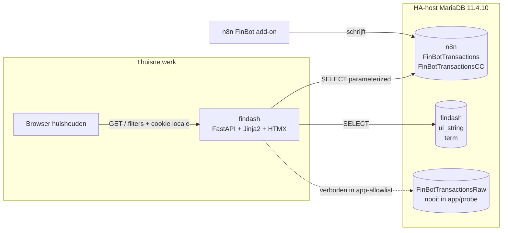
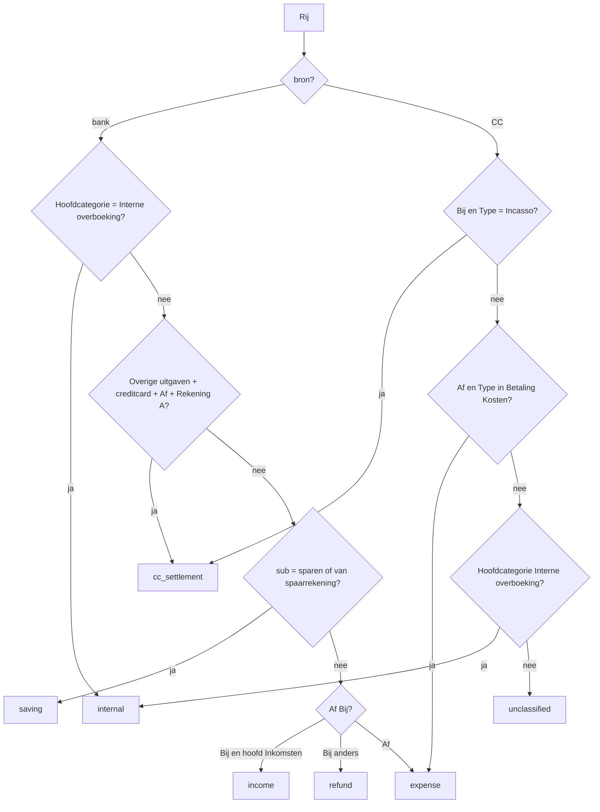
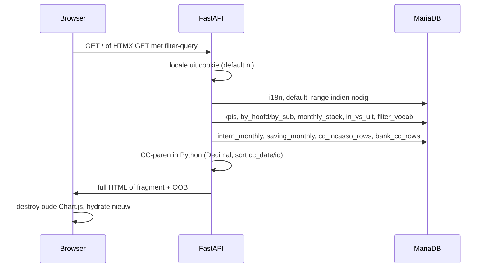

# findash v1 — lokaal finance-dashboard

| Veld | Waarde |
|---|---|
| Auteur | findash-ontwerp |
| Datum | 2026-09-08 |
| Status | **Draft** — ter goedkeuring. Geen applicatiecode tot de gebruiker dit ontwerp goedkeurt. |
| Bron | [`docs/briefing.md`](briefing.md) (live schema 2026-09-08), [`AGENTS.md`](../AGENTS.md), [`scripts/`](../scripts/), [`.env.example`](../.env.example) |
| Taal | Nederlands (product); identifiers/SQL/code in het Engels |
| Revisie | 2026-09-08c — nits: `{FINDASH_DATABASE}`-qualify, utf8mb4 op tabellen, HTMX in PR 4a, `load_env` blijft in `app/config.py` |

---

## Overview

Het huishouden heeft gecategoriseerde bank- en creditcardmutaties in MariaDB (`n8n.FinBotTransactions` ~6595 rijen, `n8n.FinBotTransactionsCC` ~390 rijen na de nainvoer juni/juli 2025), gevuld door n8n/FinBot. Bestaande Grafana-queries zijn te grof: ze filteren vooral `Hoofdcategorie != 'Interne overboeking'` en laten creditcard-aflossing en sparen in de uitgaven staan. Daardoor worden interne stromen dubbel of fout geteld.

**v1** is één lokaal overzicht (geen login, niet op internet) dat echte uitgaven en inkomsten toont, met filters, drie grafieken en NL/EN/RU. Interne overboekingen, CC-aflossing/stortingen en sparen tellen **niet** mee in de hoofdtotalen, maar blijven inspecteerbaar op dezelfde pagina. De aanbevolen stack is **FastAPI + Jinja2 + HTMX 2.0.4 + Chart.js 4.4.8 + pymysql**, primair draaiend als `uvicorn` op de werkplek tegen de bestaande MariaDB 11.4.10 (Home Assistant-add-on); Compose is optioneel. Vertalingen staan in een nieuwe database `findash` op dezelfde server. De runtime-user `findash` blijft `SELECT`-only. De app en `scripts/probe_schema.py` queryen nooit `FinBotTransactionsRaw`; `scripts/test_db_access.py` mag uitsluitend `SELECT 1` op Raw om de add-on-`n8n.*`-GRANT te documenteren.

---

## Background & Motivation

### Huidige staat

- **Brondata:** FinBot schrijft naar de HA MariaDB-add-on. Twee anonieme tabellen zijn bruikbaar; Raw is technisch `SELECT`-baar door een add-onbeperking (`GRANT` op heel `n8n`) maar mag niet in de app of in `probe_schema.py` worden bevraagd.
- **Toegang:** user `findash` (live: `'findash'@'%'`, `SELECT` op `n8n`). Connectie via gitignored `.env` (template: `.env.example`). Probes: `scripts/test_db_access.py`, `scripts/probe_schema.py` met `pymysql`.
- **Grafana** draait al op dezelfde host. Filterlogica is onvolledig; i18n en een vriendelijke UI passen slecht bij Grafana.
- **Volume:** ~7k rijen, distincts/COUNT ~20–100 ms. Geen schaalprobleem. Wel bekende indexzwaktes (prefix-4 op categorieën, geen composite `(Jaar, Maand)`).
- **Productregel:** nieuw product. Eerst ontwerp ter goedkeuring, daarna code (`AGENTS.md`).

### Pijnpunten

1. Uitgaven zijn niet betrouwbaar zolang CC-aflossing, extra CC-stortingen en sparen als “Overige uitgaven” meetellen.
2. CC-`Bij`-labels wisselen (`Aflossing`, `Interne overboeking`/`intern`, `schuldaflossing`); filteren op hoofdcategorie is fout. Matching is `Type = 'Incasso'` + `Af Bij = 'Bij'`.
3. Kaartuitgaven staan in de CC-tabel; bank-`creditcard`-Af is terugbetaling, geen tweede uitgave.
4. `Entiteit` (~1155 merchants) is te rommelig om te vertalen; UI-chrome en FinBot-termen wél.
5. Geen login is een bewuste keuze; privacy zit in netwerkbinding, read-only DB, en geen Raw/IBAN in UI of logs.

Live counts in de briefing (bank tenzij anders) zijn de werkhypothese, geen hardgecodeerde constanten in de app:

| Soort | Ordegrootte | Dashboard |
|---|---|---|
| interne overboeking (`Interne overboeking` / `intern`) | 145 bank (42 Af, 103 Bij); CC 10× intern Bij | apart blok, default uit totalen |
| Bank `Overige uitgaven` / `creditcard` / Af / Rekening A | 41 | nooit echte uitgave |
| CC `Bij` + `Type=Incasso` | 31; 31/31 matchen bank op bedrag, bank 2–4 dagen later | geen inkomen |
| Extra bank-CC-storting (zelfde bankcategorie, geen CC-`Bij`) | ~10 | ook geen uitgave |
| Sparen Af / van spaarrekening Bij | 468 / 88 | apart “sparen/vermogen” |
| Zakgeld, bijdrage opa | echte uitgave/inkomen | meenemen |
| Uitgave-categorie + `Bij` | o.a. boodschappen, kleding | terugboeking: negatieve uitgave, geen salaris |

De datamodel-paragraaf in de briefing noemt CC nog 378 rijen / 30 Incasso-`Bij` (pre-nainvoer). Na juni/juli 2025 is de werkset ~390 / 31. Queries hardcoden deze aantallen niet.

---

## Goals & Non-Goals

### Goals (v1)

- Eén overzichtspagina: uitgaven per hoofdcategorie, drill naar sub, voor een periode op `Jaar`+`Maand`.
- Filters: van–tot (jaar-maand), rekening (A / B / beide), hoofdcategorie, subcategorie.
- Interne stromen, sparen en CC-settlement default **uit** de hoofd-KPI’s, wél zichtbaar in secties op dezelfde pagina (inspect **negeert** `hoofd`/`sub`).
- Drie grafieken (niet meer): gestapelde maanden per hoofd, donut per hoofd (drill naar sub), inkomsten vs uitgaven per maand.
- Taalwisselaar NL (default) / EN / RU; vertaaltabel + seed van live distincte termen; ontbrekende vertaling → Nederlandse bronterm. `Entiteit` niet vertalen.
- Querytijd in de UI; bij traagheid een hint over bekende indexgaten. Dashboard-user maakt zelf geen indexen.
- Draaien tegen bestaande MariaDB: primair `uvicorn` op de werkplek (zelfde `.env` als `scripts/`); Compose optioneel als de container de MariaDB-host kan bereiken. Parameterized SQL; geen secrets in de frontend; `.env` blijft gitignored.
- Vrolijk visueel ontwerp (geen Grafana-grijs), vaste palet per hoofdcategorie.

### Non-Goals (v1)

- Geen login, accounts, rollen, of publieke blootstelling.
- Geen vertaal-admin-UI, geen live editor.
- Geen ingestie, geen n8n-vervanging, geen writes naar FinBot-tabellen.
- Geen query naar `n8n.FinBotTransactionsRaw` in de app of in `probe_schema.py`.
- Geen Postgres, geen tweede kopie van de transacties.
- Geen Home Assistant-add-on-pakket in v1 (wel: zelfde container later herbruikbaar).
- Geen categorisatie-hygiene (`lekker`+soft-hyphen, `overig`-emmer) als poort.
- Geen transactieregel-browser met `Mededelingen` / `Tegenrekening` / `Naam / Omschrijving` / `Omschrijving` / `Mutatie` (IBAN- en PII-risico). v1 toont aggregaties; inspect-blokken: id, datum, bedrag, `Rekening`, `Af Bij`, categorie, CC-`Type` — geen tegenrekening.
- Geen mobiele native app, geen PWA-plicht, geen dark-mode-plicht.

---

## Proposed Design

### Aanbevolen stack

| Laag | Keuze | Waarom |
|---|---|---|
| Runtime | Python 3.12, één proces | sluit aan op `scripts/` + `pymysql`; later HA-container |
| Web | FastAPI + Uvicorn | klein, typed routes, makkelijk HTML én JSON |
| HTML | Jinja2 + HTMX **2.0.4** (vendored) | server-rendered overzicht; filterwissel zonder SPA |
| Grafieken | Chart.js **4.4.8** (vendored `chart.umd.min.js`) | drie grafieken, geen npm-build |
| Font | Nunito 5.2.5 woff2 (latin 400/600/700), SIL OFL, in `app/static/fonts/` | geen Google-CDN |
| DB-driver | `pymysql` (al in `scripts/requirements.txt`) | zelfde stijl als probes; geen ORM in v1 |
| Tests | `pytest` in root-`requirements.txt` | `flow_kind` en matcher zonder live IBAN |
| CSS | eigen CSS-variabelen, geen Tailwind-pipeline | vrolijk palet, geen Node |
| Deploy | `uvicorn` op de host = primair; `Dockerfile` + Compose = optioneel | MariaDB blijft de HA-add-on |

Geen SQLAlchemy in v1. Classificatie is expliciete SQL `CASE` plus een klein Python-matchertje voor het CC-inspectblok (~70 rijen). Dat blijft leesbaar en testbaar.

### Logische architectuur



MariaDB zit **niet** in Compose. De app gebruikt `MARIADB_HOST` / `PORT` / `USER` / `PASSWORD` uit `.env` (host blijft zoals in `.env.example`; dit document herhaalt hem niet). Extra env: `FINDASH_DATABASE=findash`.

### App-structuur (te bouwen ná goedkeuring)

```
findash/
  app/
    __init__.py
    main.py              # FastAPI: /, /locale, /health, /ready
    config.py            # eigen load_env (kopie patroon scripts/db_env.py); FINDASH_* defaults; scripts/ ongemoeid
    db.py                # pymysql connect; table allowlist
    classify.py          # flow_kind-constanten + CC-paar-matcher
    queries.py           # named queries, parameterized
    i18n.py              # COALESCE(term, source_nl)
    templates/base.html
    templates/overview.html
    templates/partials/dashboard.html
    templates/partials/sub_select.html   # OOB/HTMX voor sub-dropdown
    static/css/app.css
    static/js/htmx.min.js                # HTMX 2.0.4
    static/js/chart.umd.min.js           # Chart.js 4.4.8
    static/js/charts.js
    static/fonts/                        # Nunito 5.2.5 woff2
  tests/
    test_classify.py
    test_period.py
    test_health.py
  sql/migrations/        # door operator in phpMyAdmin, niet door de app-user
  docker-compose.yml
  Dockerfile
  requirements.txt       # fastapi, uvicorn, jinja2, python-multipart, pymysql, pytest
  scripts/               # bestaande probes + list_terms.py
```

Identificatoren met spaties blijven gequoted, zoals in `scripts/probe_schema.py` (`qident`): `` `Af Bij` ``, `` `Bedrag (EUR)` ``. Kolommen `Naam / Omschrijving`, `Omschrijving`, `Mededelingen`, `Mutatie`, `Tegenrekening` worden in v1 **niet geselecteerd**.

### Pagina: één overzicht

**Route:** `GET /` (en HTMX-fragment: zie query/UI-contract hieronder).

**Sparen: zelfde pagina, geen tweede route.** v1 heeft geen spaar-tab. Motivatie: één huishoud-overzicht, dezelfde periode/rekening-filters, ~556 spaarrijen, geen vermogensrekening in `Rekening` (spaar zit in `Entiteit` / subcategorieën). Een eigen route is pas zinvol bij een vermogens-tijdreeks; dat is post-v1. Sparen krijgt een KPI-kaart + maandtafel in een `<details>`-sectie onder de hoofdgrafieken.

#### Defaultperiode

Niet `MAX(Jaar, Maand)` (dat is `GREATEST` per rij) en niet `SELECT MAX(Jaar), MAX(Maand)` (jaar 2026 + maand 12 uit een ouder december).

```sql
-- query: default_range
SELECT MAX(Jaar * 100 + Maand) AS to_ym
FROM `n8n`.`FinBotTransactions`;
```

`to_ym` is de laatste importmaand van de **banktabel** (briefing: bank-`Datum` max `20260831` → `202608`). CC-max wordt **niet** gebruikt voor de default (CC-`Datum` is `tinytext`; de huishoudkalender volgt de bank).

Inclusief venster van 12 maanden: `from_ym = add_months(to_ym, -11)` met rollover:

```python
def add_months(ym: int, delta: int) -> int:
    year, month = divmod(ym, 100)          # month 1..12
    idx = year * 12 + (month - 1) + delta
    ny, nm = divmod(idx, 12)
    return ny * 100 + (nm + 1)
```

Fixture: `to_ym = 202608` → `from_ym = 202509` → periode **2025-09 t/m 2026-08** (inclusief). Lege banktabel → empty state, geen verzonnen jaartal. Ontbrekende query-params `from_*`/`to_*` → deze default; expliciete params winnen.

#### Filters (query params)

| Param | Betekenis | Binding |
|---|---|---|
| `from_year`, `from_month` | inclusief | `Jaar * 100 + Maand` op **beide** tabellen |
| `to_year`, `to_month` | inclusief | idem |
| `rekening` | `Rekening B` / `Rekening A` / leeg = beide | `Rekening = %s` op alle queries |
| `hoofd` | exacte bronterm NL | alleen expense/income-aggregaties en grafieken A–C |
| `sub` | exacte bronterm NL | idem; zonder `hoofd`: alle hoofden die die sub hebben |
| `lang` | alleen via cookie/`/locale` | — |

Nooit filteren of sorteren op bank-`Datum` **en** CC-`Datum` door elkaar: bank-`Datum` is `int(8)` `yyyymmdd`; CC-`Datum` is `tinytext` `dd-mm-yyyy`. Periode = `Jaar`+`Maand` overal.

Rekeningfilter toont alleen **eigen** rekeningen (A, B). Labels `Rekening C` / `Rekening opa` zijn tegenrekening, geen filteroptie. CC-rijen zijn op de CC-rekening: filter rekening B → geen kaartuitgaven, dat is correct.

**`hoofd` / `sub` gelden niet voor inspectsecties** (intern, sparen, CC-aflossing). Die blijven zichtbaar bij drill `hoofd=Huishouden`, anders verdwijnen ze (andere hoofden). Inspect filtert alleen periode + optioneel `rekening`.

Cascading dropdowns (query `filter_vocab`):

- `hoofd`-opties = distinct `Hoofdcategorie` uit UNION bank+CC (hele dataset, niet de periode — je kunt een hoofd kiezen en daarna de periode wijzigen).
- `sub`-opties: als `hoofd` gezet, alleen subs van dat hoofd; als `hoofd` leeg, alle subs (zelfde naam onder twee hoofden — briefing: `boeken`, `dansles`, `laadvergoeding` — is toegestaan; de aggregatie matcht dan alle hoofden met die sub).
- Hoofden/subs met `uitgaven_netto = 0` in de **huidige** periode worden weggelaten uit tabel en donut, niet uit de dropdown.

#### Layout (boven → onder)

1. **Header** (buiten `#dashboard`): naam, taalwisselaar NL | EN | RU.
2. **Filterbalk `#filters`** (buiten `#dashboard`, niet meeswapen): van, tot, rekening, hoofd, `#sub-wrap` (sub-select). Voorkomt focus-reset bij HTMX-swap.
3. **`#dashboard`:** periode-samenvatting + rest van 4–8.
4. **KPI-rij (echte stromen):** Uitgaven (netto), Inkomsten, Verschil (inkomsten − uitgaven). Reageren op `hoofd`/`sub`.
5. **KPI-rij (uitgesloten, secundair):** Intern volume, Sparen netto, CC-aflossing/stortingen. **Negeert** `hoofd`/`sub`. Klik scrollt naar de bijbehorende `<details>`.
6. **Grafieken:** (A) stacked bar, (B) donut, (C) inkomsten vs uitgaven.
7. **Tabel** uitgaven per hoofd (kolommen: netto, uitgaven Af, terugboekingen Bij); klik op een rij zet `hoofd=` (drill). Bij actieve `hoofd`: subtabel. Rijen met netto 0 weglaten. Terugboekingen blijven in dezelfde hoofd/sub (netto = Af − Bij) maar zijn als kolom zichtbaar.
8. **Inspectsecties** (`<details>`, default dicht): Interne stromen (KPI + maandtafel, geen 145-rijendump), Sparen/vermogen (KPI + maandtafel), CC-aflossing (rij-niveau: matches + extra stortingen — grain nodig voor de matcher), **Terugboekingen** (maandtafel: jaar, maand, hoofd, sub, rekening, som, aantal — zelfde `hoofd`/`sub`-filter als de uitgaventabel, zodat je ze in context ziet).
9. **Footer:** som querytijd; bij drempel een indexhint.

### Classificatie (`flow_kind`)

Regels zijn **ordeninggevoelig**. Ze leven in één SQL-`CASE` per bron plus Python-constanten met dezelfde namen, zodat tests de SQL niet hoeven te parsen.

**Bedrag-invariant:** `` `Bedrag (EUR)` `` (bank) en `Bedrag` (CC) zijn `decimal(10,2)` en in de live data **≥ 0**. Richting zit alleen in `` `Af Bij` `` (`Af` = uit, `Bij` = in). Python vergelijkt en sommeert als `decimal.Decimal`, nooit `float`.



**Bank** (`n8n.FinBotTransactions`, bedragkolom `` `Bedrag (EUR)` ``):

1. `Hoofdcategorie = 'Interne overboeking'` → `internal` (sub is live `intern`).
2. `Hoofdcategorie = 'Overige uitgaven'` AND `Subcategorie = 'creditcard'` AND `` `Af Bij` = 'Af' `` AND `Rekening = 'Rekening A'` → `cc_settlement`. **Alle** rijen, matched of niet. Geen echte uitgave.
3. `Subcategorie = 'sparen'` (hoofd `Overige uitgaven`) of `Subcategorie = 'van spaarrekening'` (hoofd `Inkomsten`) → `saving`.
4. `` `Af Bij` = 'Bij' `` AND `Hoofdcategorie = 'Inkomsten'` → `income` (salaris, toeslagen, bijdrage opa, …).
5. `` `Af Bij` = 'Bij' `` anders → `refund` (negatieve uitgave in die hoofd/sub, geen inkomen).
6. `` `Af Bij` = 'Af' `` anders → `expense` (inclusief zakgeld).

**CC** (`n8n.FinBotTransactionsCC`, bedragkolom `Bedrag`):

1. `` `Af Bij` = 'Bij' `` AND `Type = 'Incasso'` → `cc_settlement`. **Niet** op hoofdcategorie matchen.
2. `` `Af Bij` = 'Af' `` AND `Type IN ('Betaling', 'Kosten')` → `expense` (echte kaartuitgave, één keer tellen).
3. `Hoofdcategorie = 'Interne overboeking'` → `internal` (vangnet; live intern-`Bij` overlap vaak met Incasso en is dan al `cc_settlement`).
4. Rest → `unclassified` (inspect; briefing: 2× `schuldaflossing` Bij niet extra aannames — als `Type=Incasso` vallen ze onder regel 1).

**KPI-formules** (alle `SUM` over `Decimal`-bedragen ≥ 0; richting via `flow_kind` / `Af Bij`):

| KPI | Formule | Filters |
|---|---|---|
| Uitgaven netto | `SUM(expense) − SUM(refund)` over bank+CC | periode, rekening, **hoofd, sub** |
| Terugboekingen (zicht) | `SUM(refund)` over bank+CC; **niet** extra van het netto af (al in de regel hierboven) | periode, rekening, **hoofd, sub** — chip onder uitgaven + inspect |
| Inkomsten | `SUM(income)` alleen bank | periode, rekening, **hoofd, sub** (sub zonder hoofd: alle matching hoofden) |
| Verschil | inkomsten − uitgaven netto | zelfde als de twee boven |
| Intern volume | `SUM(internal AND Af)` over bank+CC | periode, rekening; **niet** hoofd/sub. Eén been, geen dubbeltelling A↔B |
| Sparen netto | `SUM(saving AND Af) − SUM(saving AND Bij)` | periode, rekening; **niet** hoofd/sub |
| CC-aflossing/stortingen | `SUM(bank creditcard-Af)` = alle bank-`cc_settlement` | periode, rekening; **niet** hoofd/sub. Dekt matches + extra stortingen; **geen** optelling van CC-Incasso (anders dubbel) |

CC-`Bij` telt nooit als inkomen. Bank-`creditcard`-Af telt nooit als uitgave.

SQL-vorm: één derived table (`UNION ALL` van bank- en CC-`CASE`), daarna `SUM`/`GROUP BY` in de buitenste query. Geen CTE’s nodig. Op ~7k rijen is de UNION van alle `flow_kind`s acceptabel; de buitenste `SUM`/`WHERE flow_kind IN (…)` kiest de KPI. Python bouwt `WHERE` alleen met aanwezige filters (allowlist kolommen), bound params — geen `(%s IS NULL OR col = %s)`-verdubbeling.

Schets uitgaven per hoofd (periode + optioneel rekening/hoofd/sub; `hoofd`/`sub` hier wél, want dit is geen inspect):

```sql
-- query: by_hoofd  (periode altijd op Jaar/Maand; nooit CC.Datum)
SELECT Hoofdcategorie,
       SUM(CASE WHEN flow_kind = 'expense' THEN bedrag
                WHEN flow_kind = 'refund'  THEN -bedrag
                ELSE 0 END) AS uitgaven_netto
FROM (
  SELECT Hoofdcategorie, `Bedrag (EUR)` AS bedrag,
         CASE
           WHEN Hoofdcategorie = 'Interne overboeking' THEN 'internal'
           WHEN Hoofdcategorie = 'Overige uitgaven'
            AND Subcategorie = 'creditcard'
            AND `Af Bij` = 'Af'
            AND Rekening = 'Rekening A' THEN 'cc_settlement'
           WHEN Subcategorie IN ('sparen', 'van spaarrekening') THEN 'saving'
           WHEN `Af Bij` = 'Bij' AND Hoofdcategorie = 'Inkomsten' THEN 'income'
           WHEN `Af Bij` = 'Bij' THEN 'refund'
           WHEN `Af Bij` = 'Af' THEN 'expense'
           ELSE 'unclassified'
         END AS flow_kind
  FROM `n8n`.`FinBotTransactions`
  WHERE (Jaar * 100 + Maand) BETWEEN %s AND %s
    /* + optioneel AND Rekening = %s AND Hoofdcategorie = %s AND Subcategorie = %s */
  UNION ALL
  SELECT Hoofdcategorie, Bedrag AS bedrag,
         CASE
           WHEN `Af Bij` = 'Bij' AND `Type` = 'Incasso' THEN 'cc_settlement'
           WHEN `Af Bij` = 'Af' AND `Type` IN ('Betaling', 'Kosten') THEN 'expense'
           WHEN Hoofdcategorie = 'Interne overboeking' THEN 'internal'
           ELSE 'unclassified'
         END AS flow_kind
  FROM `n8n`.`FinBotTransactionsCC`
  WHERE (Jaar * 100 + Maand) BETWEEN %s AND %s
    /* + dezelfde optionele AND's */
) t
GROUP BY Hoofdcategorie
HAVING uitgaven_netto <> 0;
```

`db.py` kent een allowlist: `n8n.FinBotTransactions`, `n8n.FinBotTransactionsCC`, `{FINDASH_DATABASE}.ui_string`, `{FINDASH_DATABASE}.term` (`FINDASH_DATABASE` ∈ `{findash, n8n}`). Tabelnamen komen **nooit** uit request-input. Verboden in de app: `FinBotTransactionsRaw`.

### Named queries (één pagina-load)

Python-functies in `queries.py`; elke execute via `timed()` (patroon `scripts/probe_schema.py`). Som in de footer.

| Naam | Doel | Filters | Grain |
|---|---|---|---|
| `default_range` | `MAX(Jaar*100+Maand)` bank | — | scalar |
| `i18n` | `{FINDASH_DATABASE}.ui_string` + `.term` voor `nl` en cookie-locale | — | key→text |
| `filter_vocab` | distinct `Rekening`, `Hoofdcategorie`, `Subcategorie` UNION bank+CC | `hoofd` beperkt sub-lijst | dropdowns |
| `kpis` | zes formules hierboven (één of twee SQL-roundtrips: echte vs uitgesloten) | zie tabel formules | scalars |
| `by_hoofd` | netto, expense, refund per hoofd | periode, rekening, hoofd, sub | tabel + donut zonder `hoofd` (donut = netto) |
| `by_sub` | idem per sub (alleen als `hoofd` gezet) | periode, rekening, hoofd, sub | subtabel + donut met `hoofd` |
| `refund_monthly` | refunds per `(Jaar, Maand, Hoofdcategorie, Subcategorie, Rekening)` | periode, rekening, hoofd, sub | inspect terugboekingen |
| `monthly_stack` | netto-uitgaven per `(Jaar, Maand, Hoofdcategorie)` | periode, rekening, hoofd, sub | chart A; **alle** maanden in `[from,to]` op de x-as, ook 0 |
| `in_vs_uit` | per `(Jaar, Maand)`: inkomsten vs netto-uitgaven | periode, rekening, hoofd, sub | chart C; zelfde continue x-as |
| `intern_monthly` | intern Af/Bij per `(Jaar, Maand, Rekening, Af Bij)` | periode, rekening | inspect maandtafel |
| `saving_monthly` | saving Af/Bij per `(Jaar, Maand, Subcategorie)` | periode, rekening | inspect maandtafel |
| `cc_incasso_rows` | CC `Bij`+`Type=Incasso` in fetch-window | periode ± 4 dagen, rekening | matcher-input |
| `bank_cc_rows` | bank creditcard-Af in fetch-window | periode ± 4 dagen, rekening | matcher-input |
| `unclassified_count` | `COUNT` `flow_kind='unclassified'` | periode, rekening | footer/inspect als > 0 |

Geen 145-rijendump voor intern. CC-inspect blijft rij-niveau ná de matcher (~70 rijen).

### CC-matching (inspect, niet voor uitsluiting)

Uitsluiting is categorie/Type (hierboven). Matching is alleen voor het blok “CC-aflossing”.

**Fetch-window (4 kalenderdagen extra):** een Incasso op de laatste dag van `to_ym` heeft de bank-Af tot +4 dagen in de volgende maand nodig; een bank-Af op de eerste dag van `from_ym` heeft de CC tot −4 dagen nodig.

- Zichtbaar: `from_ym .. to_ym` (jaar-maand inclusief).
- `cc_incasso_rows`: CC-datum (uit `Jaar, Maand, Dag`) ∈ `[first_day(from_ym) − 4d, last_day(to_ym)]`.
- `bank_cc_rows`: bank-datum `STR_TO_DATE(CAST(Datum AS CHAR), '%Y%m%d')` ∈ `[first_day(from_ym), last_day(to_ym) + 4d]`.
- Na matchen, **tonen** als minstens één been in het zichtbare maandvenster valt (Incasso op de laatste dag blijft zichtbaar met z’n bankpaar).

Algoritme in Python op twee kleine resultsets, niet via SQL-JOIN:

1. Bedragen als `decimal.Decimal` (pymysql levert dat voor `decimal(10,2)`); vergelijking `==` op `Decimal`, nooit `float`.
2. Sorteer CC op `(cc_date, id)` **oplopend**. Loop in die volgorde (eerste Incasso wint bij twee dezelfde bedragen).
3. Per CC-rij: kandidaat-bankrijen met `bedrag == cc.bedrag`, `bank_date ∈ [cc_date + 2 dagen, cc_date + 4 dagen]`, nog niet gematcht.
4. Bij meerdere bankkandidaten: kleinste `|bank_date − cc_date|`, daarna laagste bank-`id`.
5. Overgebleven bankrijen in het zichtbare venster → `unmatched_topup`. Overgebleven CC in het zichtbare venster → `unmatched_cc` (live 0 na backfill; wél tonen).

Inspectkolommen (geen IBAN, geen `Mededelingen`): datum CC, datum bank, bedrag, `Rekening`, `Af Bij`, `Hoofdcategorie`, `Subcategorie`, CC-`Type`, status (`matched` / `unmatched_topup` / `unmatched_cc`). Intern-maandtafel: `Jaar`, `Maand`, `Rekening`, `Af Bij`, som, aantal.

Fixture-tests (geen live DB): twee Incassos zelfde bedrag → eerste `(cc_date, id)` pakt de enige bankrij; `Decimal('10.10')` vs `10.1` float mag niet de matcher zijn; venster `2026-08` laadt bank tot 4 sep.

### Query / HTMX-contract



**DOM:**

- `#filters` staat in `overview.html` **buiten** `#dashboard`. Inputs houden focus bij swap.
- Filterwijziging: `hx-get="/" hx-target="#dashboard" hx-include="#filters" hx-push-url="true" hx-swap="innerHTML"`.
- Response van die GET (als `HX-Request: true`): innerHTML van `#dashboard` **plus** een OOB-fragment `hx-swap-oob="innerHTML:#sub-wrap"` zodat de sub-dropdown (in de filterbalk) meeverandert als `hoofd` wijzigt, zonder de hele balk te vervangen.
- Eerste load / taalwissel / ontbrekende HTMX: volledige pagina.
- `charts.js`: op `htmx:beforeSwap` bestaande Chart.js-instanties op canvassen in `#dashboard` `destroy()`; op `htmx:afterSwap` opnieuw `JSON.parse` + `new Chart`. Zonder destroy lekken listeners na elke filter.

**JSON in HTML (XSS):** payloads als Python-`dict`/`list` (keys = NL-brontermen) naar Jinja:

```html
<script type="application/json" id="chart-monthly-stack">{{ chart_monthly_stack | tojson }}</script>
```

`|tojson` is verplicht (escaped `</script>` in categorieën). Geen handmatige `json.dumps` in een `<script>` zonder HTML-safe encoding. Geen `Markup` / `|safe` op FinBot-strings. `charts.js` doet `JSON.parse(document.getElementById(...).textContent)`.

### Grafieken (vast set van drie)

| Id | Type | Data | Interactie |
|---|---|---|---|
| A `monthly-stack` | Chart.js 4.4.8 bar, stacked | query `monthly_stack` | legenda toggle; kleuren vast op NL-bronterm |
| B `hoofd-donut` | doughnut | `by_hoofd`, of `by_sub` als `hoofd` gezet; 0-rijen weglaten | klik op segment → zet `hoofd` of `sub` via HTMX (include `#filters`) |
| C `in-vs-uit` | grouped bar | query `in_vs_uit`; inkomsten = `--teal`, uitgaven = `--coral` | geen extra drill |

Geen lijn-vermogen, geen heatmap, geen sankey. Interne/sparen/CC zitten niet in A–C.

Kleuren per **uitgave-hoofd** (CSS-variabelen én Chart.js-map, key = Nederlandse `Hoofdcategorie`):

| Hoofd | Kleur |
|---|---|
| Huishouden | `#E76F51` |
| Wonen | `#2A9D8F` |
| Vrije tijd | `#E9C46A` |
| Vervoer | `#4CC9F0` |
| Telecom/tech | `#7B68EE` |
| Voorkomen | `#F4A261` |
| Medische kosten | `#E07A9A` |
| Verzekeringen | `#52B788` |
| Educatie | `#3D8BFF` |
| Overige uitgaven | `#C77DFF` |
| Interne overboeking | `#8D99AE` (inspect, niet in A–B default) |
| Aflossing | `#8D99AE` (CC-taxonomie; inspect) |

Inkomsten is **geen** uitgave-hoofd in A/B. KPI C en de inkomsten-KPI gebruiken `--teal` (`#2A9D8F`) vs uitgaven `--coral` (`#E76F51`) — dat is de enige inkomstenkleur, geen tweede palet-entry die met Wonen botst in stacked bars. Onbekende nieuwe hoofd: hash naar een van de accenten, plus fallback-rand.

### Visueel palet (“zomer”)

Geen Grafana-donkergrijs. Ronde kaarten, ruim wit, grote KPI-cijfers (tabular nums), vriendelijke koppen.

| Token | Waarde | Gebruik |
|---|---|---|
| `--bg` | `#FBF6EE` | paginabackground (warm crème) |
| `--surface` | `#FFFFFF` | kaarten |
| `--ink` | `#1B3A4B` | tekst |
| `--muted` | `#5C6B73` | hints, footer |
| `--coral` | `#E76F51` | uitgaven, primaire accent |
| `--teal` | `#2A9D8F` | inkomsten-KPI en chart C-inkomsten |
| `--sun` | `#E9C46A` | highlights, taal-actief |
| `--sky` | `#4CC9F0` | links, focus-ring |
| `--radius` | `16px` | kaarten |
| Font | `ui-rounded, "Nunito", "Segoe UI", system-ui, sans-serif` | Nunito 5.2.5 woff2 lokaal |

Bedragen: `nl-NL` / `en-GB` / `ru-RU` via `Intl.NumberFormat` in JS voor charts; server-side `format_eur(value, locale)` in Jinja. Valuta altijd EUR, geen FX.

### i18n

Twee tabellen, altijd gekwalificeerd als `{FINDASH_DATABASE}.ui_string` en `{FINDASH_DATABASE}.term` (env, default `findash`; fallback `n8n`). Python hardcodet de schema-string `findash` niet; de identifier komt uit env, allowlist `{findash, n8n}`.

1. `{FINDASH_DATABASE}.ui_string` — chrome (catalogus hieronder, geen vrije keys in v1).
2. `{FINDASH_DATABASE}.term` — FinBot-vocabulaire (`namespace` + `source_nl`).

Locales: `nl` (bron, default), `en`, `ru`. Cookie `findash_lang`: `Path=/`, **geen** `Domain`, `HttpOnly`, `SameSite=Lax`, `Secure=False` (v1 is HTTP op LAN; `Secure=true` zou de cookie nooit zetten). `POST /locale` met `lang` ∈ `{nl,en,ru}` (anders 400) → cookie → **303 naar `/` alleen** (geen Referer-redirect). Ontbrekende rij: toon `source_nl` resp. de NL-`ui_string`.

`Entiteit` zit niet in `term`. Merchants as-is.

Namespaces `term`: `hoofd`, `sub`, `af_bij`, `mutatiesoort`, `cc_type`, `rekening`. Distincts komen uit `scripts/list_terms.py` (nieuw): UNION van bank+CC, inclusief CC-`Type` (bestaande `probe_schema.py` `vocab_cols` mist `Type` — niet “alleen probe overnemen”). Mutatiesoorten niet in dit document verzinnen.

**`ui_string.string_key` catalogus (v1, alle drie locales in de NL-seed; EN/RU in PR 2b):**

| Key | NL-bron (intent) |
|---|---|
| `app.title` | findash |
| `lang.nl` / `lang.en` / `lang.ru` | Nederlands / English / Русский |
| `filter.from` `filter.to` `filter.year` `filter.month` | Van / Tot / Jaar / Maand |
| `filter.rekening` `filter.hoofd` `filter.sub` `filter.all` | Rekening / Hoofdcategorie / Subcategorie / Alle |
| `kpi.expenses` `kpi.income` `kpi.delta` `kpi.refunds` | Uitgaven / Inkomsten / Verschil / Terugboekingen |
| `kpi.internal` `kpi.saving` `kpi.cc_settlement` | Interne stromen / Sparen / CC-aflossing |
| `chart.monthly_stack` `chart.donut` `chart.in_vs_uit` | koppen A/B/C |
| `chart.income_series` `chart.expense_series` | Inkomsten / Uitgaven (legend C) |
| `table.hoofd` `table.sub` `table.amount` `table.empty` | kolommen + leeg |
| `inspect.internal` `inspect.saving` `inspect.cc` `inspect.refunds` | `<details>`-samenvattingen |
| `inspect.cc.matched` `inspect.cc.unmatched_topup` `inspect.cc.unmatched_cc` | statuslabels |
| `inspect.col.id` `inspect.col.date` `inspect.col.amount` `inspect.col.rekening` `inspect.col.af_bij` `inspect.col.hoofd` `inspect.col.sub` `inspect.col.type` `inspect.col.status` | inspectkolommen |
| `footer.queries` `footer.index_hint` | querytijd / indexhint |
| `empty.no_data` `health.db_down` | empty / DB weg |

Nieuwe FinBot-term na release: fallback NL tot de volgende seed. Dashboard-user: alleen `SELECT`. Writes = operator (phpMyAdmin) als admin, nooit de runtime-user.

### Docker en run-modes

MariaDB blijft de HA-add-on. Compose bevat geen database. `network_mode: host` is op macOS **niet** equivalent aan Linux en is geen v1-oplossing.

**Ondersteunde v1-run (in deze volgorde):**

| Mode | Wanneer | `MARIADB_HOST` | Bind |
|---|---|---|---|
| **A — primair** | ontwikkeling op de Mac | zelfde `.env` als `scripts/test_db_access.py` (host bereikbaar vanaf de werkplek) | `FINDASH_HOST=127.0.0.1` (waarde in `.env.example`) |
| **B — Compose** | optioneel, zelfde repo | host moet **vanuit de container** bereikbaar zijn: LAN-adres van de HA-MariaDB, of `host.docker.internal` als de operator dat nodig heeft, of Compose op de HA-machine zelf | Compose zet `FINDASH_HOST=0.0.0.0` in `environment:` (overschrijft example); publicatie `127.0.0.1:8088:8088` |

Mode A is de implementatie-default voor PR 1: als `scripts/` al connecten, connect `uvicorn` ook. Mode B is geen merge-blocker; documenteer in de Compose-header dat Desktop een ander RFC1918-bereik heeft dan de HA-host.

Operatorcheck Compose (geen wachtwoord printen):

```bash
docker compose exec web python -c "from app.db import ping; ping()"
```

`ping()` doet `SELECT 1` en print `ok` of een foutzonder DSN.

```yaml
# schets — secrets alleen via env_file
services:
  web:
    build: .
    ports:
      - "127.0.0.1:8088:8088"
    env_file: .env
    environment:
      FINDASH_HOST: "0.0.0.0"
      FINDASH_PORT: "8088"
    restart: unless-stopped
    healthcheck:
      test: ["CMD", "python", "-c", "import urllib.request; urllib.request.urlopen('http://127.0.0.1:8088/health')"]
      interval: 30s
      timeout: 5s
      retries: 3
```

Poort **8088** vermijdt HA 8123/443, Grafana 3000, phpMyAdmin 8080. Default publicatie **loopback op de host**; de operator kan `127.0.0.1` vervangen door een LAN-IP. Niet publiceren naar guest-VLAN of internet. Image: `python:3.12-slim`, non-root user, `uvicorn app.main:app --host 0.0.0.0 --port 8088`. Healthcheck raakt `/health` (liveness), niet `/ready`.

Later HA Supervised: dezelfde image; geen extra database-engine.

---

## API / Interface Changes

Er is nog geen app. v1-oppervlak:

| Method | Pad | Doel |
|---|---|---|
| `GET` | `/` | Overzicht; HTMX: `#dashboard` + OOB `#sub-wrap` als `HX-Request: true` |
| `POST` | `/locale` | Form `lang=nl\|en\|ru` (anders 400) → cookie → **303 `/`** |
| `GET` | `/health` | Liveness. `200` + JSON `{ "ok": true, "findash_schema": "ok" \| "missing" }` als `SELECT 1` lukt. Schema-check = `SELECT 1 FROM {FINDASH_DATABASE}.ui_string LIMIT 1` (env, default `findash`). **`findash_schema: missing` wijzigt de statuscode niet** (Compose blijft up tijdens operator-GRANT). `503` alleen als MariaDB onbereikbaar. Geen credentials, geen schema-dump |
| `GET` | `/ready` | Readiness. `200` als `SELECT 1` én `{FINDASH_DATABASE}.ui_string` bestaat (zelfde env, default `findash`); `503` als DB weg of die tabel missing. Niet gebruiken als Compose-healthcheck in PR 1 |

Geen JSON-public API in v1. Geen CORS. `/locale` same-site, allowlist pad `/`. Geen secrets in HTML.

`.env.example` uitbreiden, **hostregel ongewijzigd laten** (niet leegmaken; het is geen secret). Alleen `MARIADB_PASSWORD` blijft leeg. Extra keys:

```
FINDASH_DATABASE=findash
FINDASH_HOST=127.0.0.1
FINDASH_PORT=8088
FINDASH_DEFAULT_LOCALE=nl
```

In-container bind is **niet** de example-waarde: Compose `environment: FINDASH_HOST=0.0.0.0`.

`app/config.py` **kopieert het `load_env`-patroon** uit `scripts/db_env.py` (niet importeren: `scripts/` is geen package, Docker/`uvicorn` hebben het niet op `PYTHONPATH`). `scripts/db_env.py` `REQUIRED` blijft alleen `MARIADB_*` — geen `FINDASH_*` toevoegen, anders falen bestaande probes tot elke `.env` is bijgewerkt. In `app/config.py` zijn `FINDASH_DATABASE` / `FINDASH_HOST` / `FINDASH_PORT` / `FINDASH_DEFAULT_LOCALE` optioneel, defaults `findash` / `127.0.0.1` / `8088` / `nl`. `FINDASH_DATABASE` alleen `findash` of `n8n`. Geen `FINDASH_UNSAFE_DEBUG`: nooit SQL+wachtwoord dumpen.

---

## Data Model Changes

Geen wijziging aan FinBot-tabellen. Geen index-DDL door de app-user.

### Nieuwe database `findash`

Aanbevolen t.o.v. tabellen in `n8n`: FinBot-data blijft van n8n; migraties/seeds van findash mengen niet. Runtime-user krijgt `SELECT` op `findash.*` (database-niveau: de add-on overschrijft tabel-GRANTs bij start).

`sql/migrations/001_create_findash.sql` maakt **alleen tabellen** (geen `CREATE DATABASE` in het live pad). De GUI maakt de database. Headercomment in `001`: *fallback: vervang schema `findash` door `n8n` en zet `FINDASH_DATABASE=n8n`*. Seeds (`002`–`004`) gebruiken dezelfde qualifier; bij fallback dezelfde replace.

```sql
-- Primary schema: findash (GUI). Fallback: replace `findash` with `n8n`.
CREATE TABLE `findash`.`ui_string` (
  `id` INT UNSIGNED NOT NULL AUTO_INCREMENT,
  `string_key` VARCHAR(128) NOT NULL,
  `locale` CHAR(5) NOT NULL,
  `text` VARCHAR(512) NOT NULL,
  PRIMARY KEY (`id`),
  UNIQUE KEY `uq_ui_key_locale` (`string_key`, `locale`)
) ENGINE=InnoDB DEFAULT CHARSET=utf8mb4 COLLATE=utf8mb4_unicode_ci;

CREATE TABLE `findash`.`term` (
  `id` INT UNSIGNED NOT NULL AUTO_INCREMENT,
  `namespace` VARCHAR(32) NOT NULL,
  `source_nl` VARCHAR(191) NOT NULL,
  `locale` CHAR(5) NOT NULL,
  `text` VARCHAR(191) NOT NULL,
  PRIMARY KEY (`id`),
  UNIQUE KEY `uq_term_ns_src_loc` (`namespace`, `source_nl`, `locale`),
  KEY `idx_term_lookup` (`locale`, `namespace`)
) ENGINE=InnoDB DEFAULT CHARSET=utf8mb4 COLLATE=utf8mb4_unicode_ci;
```

`source_nl` 191: utf8mb4 unique-prefix-limiet op InnoDB. `CHARSET`/`COLLATE` op de tabellen zodat fallback-in-`n8n` niet van een latin1-default erft.

NL hoeft niet in `term`: de bronkolom ís NL. `ui_string` wél voor de locales die we seeden (PR 2a: `nl`; PR 2b: `en`/`ru`).

### Migratiestrategie

- `sql/migrations/001_create_findash.sql` — `CREATE TABLE` (comment: database bestaat via GUI; fallback: schema `findash` → `n8n`).
- `002_seed_ui_string_nl.sql` — catalogus hierboven, locale `nl`.
- `003_seed_term.sql` — EN/RU FinBot-termen (PR 2b; mag leeg starten met alleen structuur).
- `004_seed_ui_string_en_ru.sql` — chrome EN/RU (PR 2b).
- Idempotent waar mogelijk (`CREATE TABLE IF NOT EXISTS`, `INSERT ... ON DUPLICATE KEY UPDATE`).
- Uitvoeren als MariaDB-**admin** in phpMyAdmin, **niet** als user `findash`.
- App start niet auto-migrate. Ontbrekende `{FINDASH_DATABASE}.ui_string`: `/health` blijft 200 met `findash_schema: missing`; `/` toont NL-hardcoded chrome-fallback tot de seed er is (keys uit de catalogus in code als laatste vangnet); `/ready` 503.

### Rechten — één operatorsequentie

Live add-on: `'findash'@'%'` + `SELECT` op hele databases in de GUI-`rights`. Tabel-GRANTs in `docs/sql/create-findash-user.sql` worden bij add-on-start overschreven — die template is **niet** de runtime-waarheid. phpMyAdmin-als-findash kan geen GRANT/migratie toepassen.

1. MariaDB-add-on GUI: database `findash` aanmaken met **utf8mb4** / **utf8mb4_unicode_ci** (niet de eventuele latin1-default; PR 2b Russisch).
2. GUI `rights`: user `findash`, `privileges: [SELECT]` op `n8n` **en** `findash`.
3. Add-on herstarten (overschrijft tabel-GRANTs met database-`SELECT`).
4. phpMyAdmin **admin** (niet findash): `001`–`002` (later `003`–`004`). Geen `CREATE DATABASE` in die files als de GUI dat al deed.
5. `scripts/test_db_access.py`: optioneel `FINDASH_DATABASE` lezen (default `findash`, **niet** via `db_env.py` `REQUIRED`); `SELECT 1` op `{die database}.ui_string` / `.term` als ze bestaan; Raw blijft `SELECT 1` only.

**Fallback** als de GUI geen tweede database kan: in `001`–`004` schema `findash` vervangen door `n8n`, env `FINDASH_DATABASE=n8n`. App, `/health`, `/ready` en i18n gebruiken uitsluitend `{FINDASH_DATABASE}.ui_string` / `.term`. Alleen gebruiken als stap 1 faalt; voorkeur blijft eigen database.

Documentatie-SQL mag `GRANT SELECT ON findash.* TO 'findash'@'%';` als commentaar voor een admin bevatten, niet als iets dat de dashboard-user draait.

### Indexhints (niet uitvoeren als findash-user)

- Composite `(Jaar, Maand)` ontbreekt op beide FinBot-tabellen.
- `Hoofdcategorie` / `Subcategorie`: prefix **4** op `tinytext` is krap. Voorstel operator: prefix 32.
- `` `Af Bij` `` prefix 1 is genoeg (`A`/`B`).
- `Rekening` heeft geen index; 2 waarden, laag risico.

Bij ~7k rijen is dit **latency-hygiene**, geen blocker.

---

## Alternatives Considered

### 1. Grafana op de bestaande HA-Grafana

**Voor:** al aanwezig (poort 3000), panelen snel, weinig code, SQL-panelen mogelijk.

**Tegen:** i18n pijnlijk; classificatie (CC `Type=Incasso`, refunds, sparen) = onleesbare nested queries per paneel; Grafana-grijs; drill+HTMX geen sterkte; geen findash-app voor later HA.

**Oordeel:** afgewezen voor v1. Grafana mag blijven staan voor ad-hoc.

### 2. Python FastAPI + HTMX + Jinja2 + Chart.js + pymysql (aanbevolen)

**Voor:** één proces, past bij `scripts/` (`pymysql`, `.env`, allowlist); SQL-classificatie op één plek; server-side i18n; tiny data; later HA Python-container; één ontwikkelaar.

**Tegen:** minder “app-achtig” dan React; Chart.js eenvoudiger dan ECharts; HTMX-kennis, maar één pagina.

**Subkeuzes (niet gekozen):** SQLAlchemy ORM — te veel abstractie voor `CASE` + rare kolomnamen. Streamlit/Dash — slechte i18n/layout. ECharts — drie grafieken rechtvaardigen het niet.

### 3. Next.js (of andere SPA) + API

**Voor:** polijst, component-ecosysteem.

**Tegen:** twee runtimes of alles-JS zonder bestaande MySQL-driver in de repo; zwaarder voor HA; ~7k rijen; `NEXT_PUBLIC_*`-lekrisico; te veel moving parts.

**Oordeel:** te zwaar voor v1.

### Database: `n8n` vs nieuwe `findash`

| | Tabellen in `n8n` | Eigen database `findash` |
|---|---|---|
| Isolatie | FinBot-schema vervuilen | helder eigendom |
| GRANT | extra tabel in `n8n.*` (Raw-issue blijft) | `SELECT` op `findash.*` naast `n8n.*` |
| Migraties | mix met n8n | eigen `sql/migrations/` |
| HA GUI | n8n bestaat al | database toevoegen (als GUI dat niet kan: fallback `n8n`) |

**Keuze:** `findash`, met `n8n`-tabellen als gedocumenteerde fallback.

---

## Security & Privacy Considerations

**Dreigingsmodel:** huishouden-LAN, geen internet-expositie, geen dashboard-login. Aanvallers: misconfiguratie (port forward), guest-VLAN, een gecompromitteerde LAN-client, SQL-injectie, per ongeluk Raw/IBAN in logs of UI.

| Risico | Ernst | Mitigatie |
|---|---|---|
| SQL-injectie via filters | hoog | Alleen bound parameters; identifiers allowlist; nooit tabel/kolom uit request |
| Query op `FinBotTransactionsRaw` | hoog (PII) | App-allowlist in `db.py`; `probe_schema.py` heeft Raw niet in `TABLES`; `test_db_access.py` mag alleen `SELECT 1 FROM FinBotTransactionsRaw LIMIT 1` (geen `SELECT *`, geen kolomdump) |
| IBAN in UI/logs | hoog | Geen `Tegenrekening`, `Mededelingen`, `Mutatie`, `Naam / Omschrijving` in v1-views; `probe_schema.py` redacteert account-achtige waarden |
| Secrets in frontend / git | hoog | `.env` gitignored mode 600; Compose `env_file`; geen wachtwoord in SQL in git |
| Write-rechten dashboard-user | hoog | Alleen `SELECT`; `test_db_access.py` weigert write-privs; migraties via admin |
| `'findash'@'%'` | midden | Add-on-standaard; 3306 niet op internet; operator houdt dashboard uit guest-VLAN |
| Geen login | midden | Bind default `127.0.0.1:8088`; LAN-bind is operatorkeuze |
| XSS via categorie-tekst | midden | Jinja auto-escape; chart-JSON **alleen** `{{ payload \| tojson }}` in `<script type="application/json">`; geen `\|safe` op FinBot-strings |
| Prefix-index / data leak via error | laag | Generieke foutpagina; geen pymysql-trace met SQL+wachtwoord naar de browser |
| Open redirect `/locale` | laag | 303 alleen naar `/`; `lang` allowlist |

**AuthN/Z:** geen. Autorisatie = netwerk + MariaDB-grants.

**Data handling:** aggregaties op categorie/rekening/maand. Inspect: id, datums, bedrag, `Rekening`, `Af Bij`, hoofd/sub, CC `Type`. Retention = FinBot/MariaDB; findash bewaart geen kopie.

---

## Product- en ops-risico’s

| Risico | Ernst | Mitigatie |
|---|---|---|
| FinBot voegt een hoofd/sub toe | laag | fallback NL-bronterm; onbekende `flow_kind` → `unclassified` + count in inspect |
| Add-on GUI kan `findash` DB niet aanmaken | midden | fallback tabellen in `n8n` + `FINDASH_DATABASE=n8n` |
| Matcher-botsing (twee Incassos, één bankbedrag) | laag | deterministische sort `(cc_date, id)`; toon `unmatched_cc` / `unmatched_topup` |
| Data groeit, prefix-4 blijft traag | laag | footer ≥ 300 ms + operator-indexhint; geen app-DDL |
| EN/RU-copy onjuist | laag | PR 2b na NL-UI; ontbrekende vertaling toont NL |
| Container op Desktop reikt MariaDB niet | midden | mode A (`uvicorn` op de host) is primair; mode B documenteert bereikbaarheid |

Rollback: proces/container stoppen. Geen writes naar FinBot. `findash`-DB droppen raakt n8n niet. Grafana blijft valnet.

---

## Observability

- **Accesslog:** Uvicorn; geen secrets in params.
- **Querytiming:** `timed()` per named query. Footer: `queries: 48 ms (6×)`.
  - ≥ 100 ms: amber.
  - ≥ 300 ms: hintpaneel (composite `Jaar+Maand`, categorie-prefix 4→32). Geen `ALTER`.
- **Logs (stderr):** method, pad zonder cookie-header, locale, `query_ms`, aggregatie-`row_counts`. Geen `Mededelingen`, geen IBAN, geen password.
- **Metrics:** geen Prometheus. Compose-healthcheck = `GET /health` (liveness). `/ready` voor operator/later HA.
- **Alerting:** geen.
- **Fouten:** 503 als MariaDB weg (`/health`, `/ready`); 500 generiek. `unclassified` crasht niet.

---

## Rollout Plan

Goedgekeurd door de gebruiker op 2026-09-08 (loopback; terugboekingen in dezelfde hoofd/sub én zichtbaar). Implementatie van v1 mag.

1. **Goedkeuring** — gedaan.
2. **Git init** in deze repo (nu nog geen git); `.gitignore` bestaat al.
3. **Operator (parallel, geen merge-blocker):** GUI-database `findash`; `SELECT` op `n8n` + `findash`; admin-SQL `001`–`002`.
4. **PR-keten** hieronder. Geen featureflag-dienst, geen `FINDASH_UNSAFE_DEBUG`.
5. **Verificatie:** `scripts/test_db_access.py`; `pytest` op `flow_kind`/periode/matcher met fictieve rijen; handmatig NL (later EN/RU) in de browser; `grep` dat Raw niet in `app/` of `probe_schema.py` voorkomt.
6. **Rollback:** `uvicorn`/container stoppen.
7. **Post-v1:** HA-add-on-wrapper, optioneel transactieregel-drill zonder IBAN, optioneel operator-indexen.

Geen staged canary: één huishouden.

---

## Open Questions

Beslist 2026-09-08: **loopback** om te starten; **terugboekingen in dezelfde hoofd/sub**, wél zichtbaar (tabelkolom + KPI-chip + inspect). Sparen = sectie op dezelfde pagina; grafieken = de drie hierboven; stack = optie 2; vertalingen in database `findash`; defaultperiode = 12 maanden t.o.v. `MAX(Jaar*100+Maand)` bank; intern volume = som interne **Af**; CC-KPI = som bank-creditcard-Af; `hoofd`/`sub` niet op intern/sparen/CC-inspect (wél op terugboekingen-inspect).

Nog open, niet nodig voor v1-code:

1. ~~LAN-bind~~ → loopback.
2. **EN/RU-copy-review:** technische seed in PR 2b; UI werkt met NL-fallback tot 2b.
3. ~~Refund-weergave~~ → zelfde hoofd/sub + zichtbaar.
4. **HA-add-on-packaging:** expliciet v2.

---

## References

- [`docs/briefing.md`](briefing.md) — opdracht, live datamodel, CC-matching, grants, talen.
- [`AGENTS.md`](../AGENTS.md) — mapgrens, privacy, ontwerp-vóór-code.
- [`.env.example`](../.env.example) — `MARIADB_*` (wachtwoord leeg; hostregel blijft zoals nu, niet in dit document herhaald).
- [`scripts/db_env.py`](../scripts/db_env.py), [`scripts/probe_schema.py`](../scripts/probe_schema.py), [`scripts/test_db_access.py`](../scripts/test_db_access.py) — connectie, distincts, allowlist, IBAN-redactie. Probe queryt Raw niet; access-test `SELECT 1` only.
- [`docs/sql/create-findash-user.sql`](sql/create-findash-user.sql) / [`grant-findash-select.sql`](sql/grant-findash-select.sql) — templates; live waarheid is add-on-GUI (database-`SELECT`, host `%`).
- Bestaande Grafana-query (briefing): alleen `Hoofdcategorie != 'Interne overboeking'` — te grof; v1 vervangt die logica in de app, niet in Grafana.

---

## Key Decisions

1. **Stack = FastAPI + Jinja2 + HTMX 2.0.4 + Chart.js 4.4.8 + pymysql + pytest.** Eén Python-proces. Grafana te grof; Next.js te zwaar.
2. **Eigen MariaDB-database `findash`** (default `FINDASH_DATABASE`) voor `{FINDASH_DATABASE}.ui_string` en `.term`; fallback env `n8n` als de GUI geen tweede DB kan. Runtime-user: `SELECT`, geen `INSERT`. Python hardcodet schema `findash` niet.
3. **Raw:** app + `probe_schema.py` nooit; `test_db_access.py` alleen `SELECT 1`.
4. **Periodefilter op `Jaar`+`Maand`**, nooit op CC-`Datum`. Default = 12 maanden t.o.v. `MAX(Jaar*100+Maand)` op de banktabel (`202608` → `202509..202608`).
5. **CC-settlement op `Type='Incasso'` + `Bij`**, niet op wisselende hoofdcategorie. Bank-`creditcard`-Af is nooit uitgave. Echte kaartuitgave = CC-`Af` (`Betaling`/`Kosten`).
6. **Matching is inspectie.** Sort CC `(cc_date, id)`; `Decimal`; fetch ±4 dagen; leftover = `unmatched_cc` / `unmatched_topup`.
7. **Refunds** = negatieve uitgave in dezelfde hoofd/sub (netto). Zichtbaar als kolom, KPI-chip en inspect-maandtafel. Geen aparte “inkomsten”-regel.
8. **Sparen op dezelfde pagina**, geen tweede route.
9. **Drie grafieken**, niet meer.
10. **Geen dashboard-login**; Compose publiceert `127.0.0.1:8088`. Run mode A (`uvicorn` + bestaande `.env`) is primair.
11. **i18n in MariaDB**, fallback NL; `Entiteit` niet vertalen; geen vertaal-UI. EN/RU-seed mag ná classificatie (PR 2b).
12. **Geen ORM, geen npm-build.** Vendor gepinde HTMX/Chart.js/Nunito. `|tojson` voor chart-JSON.
13. **Querytijd zichtbaar**; geen app-`ALTER`.
14. **Implementatie goedgekeurd** 2026-09-08.
15. **KPI’s:** intern volume = `SUM(internal Af)`; sparen netto = saving Af − saving Bij; CC-KPI = som bank-creditcard-Af (niet + Incasso). Bedragen unsigned, richting in `Af Bij`.
16. **`hoofd`/`sub` alleen op echte stromen en charts A–C.** Inspect: periode + rekening.
17. **`/health` = liveness** (`SELECT 1`, 200 zelfs zonder i18n-tabel). Schema-check en `/ready` kijken naar `{FINDASH_DATABASE}.ui_string` (default `findash`). Compose-healthcheck = `/health`.
18. **Filterbalk buiten `#dashboard`**; OOB-swap voor sub-select; Chart.js `destroy` vóór swap.

---

## PR Plan

Deze repo heeft nog geen git. **PR 0** is `git init` + dit document. Slices zelfstandig reviewbaar. Operator-GRANT is parallel, geen merge-blocker (i18n-tests mocken de tabellen).

Volgorde voor één ontwikkelaar: **0 → 1 → 2a → 3 → 4a → 4b → 4c → 2b → 5**. PR 3 hangt functioneel niet van 2a af; 2a staat ervoor zodat 4a keys heeft. PR 2b mag achter 3 (en achter 4a) aan: NL-fallback werkt.

### PR 0 — `chore: git init and v1 design`

- **Files:** `.gitignore` (bestaat), `docs/design-v1.md`, `docs/briefing.md`, `AGENTS.md`, `scripts/*` zoals nu.
- **Depends:** —
- **Beschrijving:** versiebeheer; ontwerp vastleggen. Geen app-code.

### PR 1 — `feat: FastAPI scaffold, health, runnable Docker`

- **Files:** `app/__init__.py`, `app/main.py`, `app/config.py` (eigen `load_env`; **niet** `from scripts.db_env import`; `FINDASH_*` optioneel met defaults), `app/db.py` (connect, allowlist, `ping()`), `tests/test_health.py`, `requirements.txt` (fastapi, uvicorn, jinja2, python-multipart, pymysql, pytest), `Dockerfile` (**non-root**, healthcheck op `/health`), `docker-compose.yml`, `.env.example` (+ `FINDASH_*`, hostregel ongemoeid). `scripts/db_env.py` ongewijzigd (`REQUIRED` = `MARIADB_*`).
- **Depends:** PR 0.
- **Beschrijving:** `GET /health` (`SELECT 1`, JSON `findash_schema` via `{FINDASH_DATABASE}.ui_string`, default `findash`, geen 503 bij missing), `GET /ready` (zelfde qualifier), `GET /` placeholder. Mode A: `uvicorn` met bestaande `.env`. Mode B in Compose-comment. Weiger identifiers buiten de allowlist. Geen secrets in logs.

### PR 2a — `feat: findash schema, NL ui_string, locale cookie`

- **Files:** `sql/migrations/001_create_findash.sql` (alleen `CREATE TABLE` + utf8mb4 + fallback-comment schema → `n8n`), `002_seed_ui_string_nl.sql` (catalogus, qualifier `{schema}`), `app/i18n.py` (`{FINDASH_DATABASE}.ui_string` / `.term`), `app/templates/base.html` (NL/EN/RU-switcher, fallback NL), `docs/sql/grant-findash-select.sql` (comment `GRANT SELECT ON findash.*`), `scripts/test_db_access.py` (`SELECT 1` op `{FINDASH_DATABASE}`-tabellen als ze bestaan, env optioneel; Raw blijft `SELECT 1`; `db_env.REQUIRED` ongewijzigd), `scripts/list_terms.py` (distincts inclusief CC-`Type`).
- **Depends:** PR 1. Live GRANT niet nodig om te mergen (gemockte i18n-tests).
- **Beschrijving:** tabellen + NL-chrome. `POST /locale` → Lax/HttpOnly/niet-Secure cookie → 303 `/`. Geen EN/RU-verplichting. Geen `Entiteit`. Geen vertaal-admin.

### PR 3 — `feat: classification queries and overview metrics`

- **Files:** `app/classify.py`, `app/queries.py` (named queries), `tests/test_classify.py`, `tests/test_period.py` (o.a. `202608` → `202509..202608`; Decimal-matcher; twee Incassos zelfde bedrag).
- **Depends:** PR 1 (2a niet strikt).
- **Beschrijving:** `flow_kind`, KPI-formules, aggregaties, CC-matcher (sort, Decimal, ±4 dagen). Parameterized `WHERE` zonder NULL-verdubbeling. Timing-wrapper. Geen Raw. Output mag kale HTML-tabel/JSON-structuur zijn.

### PR 4a — `feat: overview HTML, KPIs, table, filters`

- **Files:** `app/templates/overview.html`, `partials/dashboard.html`, `partials/sub_select.html`, `app/static/css/app.css`, `app/static/js/htmx.min.js` (**HTMX 2.0.4**, verplicht in deze PR), `app/main.py` (`GET /` met named queries).
- **Depends:** PR 2a, PR 3.
- **Beschrijving:** palet; `#filters` buiten `#dashboard`; HTMX include + OOB sub; KPI-rijen; hoofd/sub-tabel (0 weglaten); drill. Nog geen Chart.js, nog geen inspect-details.

### PR 4b — `feat: three Chart.js charts`

- **Files:** `app/static/js/chart.umd.min.js` (4.4.8), `app/static/js/charts.js`, templates (`|tojson` blobs). HTMX zit al in 4a.
- **Depends:** PR 4a.
- **Beschrijving:** stacked / donut / in vs uit; `destroy` op `htmx:beforeSwap`; klik donut zet filter.

### PR 4c — `feat: inspect sections and query timing footer`

- **Files:** templates inspect `<details>`, `app/static/fonts/` (Nunito 5.2.5), footer timing + indexhint.
- **Depends:** PR 4a (4b mag parallel ná 4a, 4c niet op 4b).
- **Beschrijving:** intern/sparen maandtafels (`Rekening` + `Af Bij`); CC-rijen matched/unmatched; footer ms; hint ≥ 300 ms. Geen transactieregel-dump.

### PR 2b — `feat: EN/RU term and ui_string seed`

- **Files:** `sql/migrations/003_seed_term.sql`, `004_seed_ui_string_en_ru.sql`, output van `scripts/list_terms.py`.
- **Depends:** PR 2a; mag ná PR 3/4a (NL-fallback).
- **Beschrijving:** EN/RU voor catalogus + live distincte FinBot-termen. Huishouden-review van RU is open vraag, geen merge-poort: ontbrekende vertaling toont NL.

### PR 5 — `chore: operator notes`

- **Files:** SQL-headers (GUI-volgorde, fallback `n8n`, geen extra product-README tenzij gevraagd), Compose-comment run mode B.
- **Depends:** PR 4c.
- **Beschrijving:** operatorsequentie in SQL-commentaar; rollback = stop. Non-root/healthcheck zitten al in PR 1.

Geen parallelle feature-PRs behalve 4b ∥ 4c na 4a, en 2b ∥ UI zodra 2a er is.
